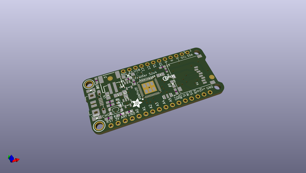
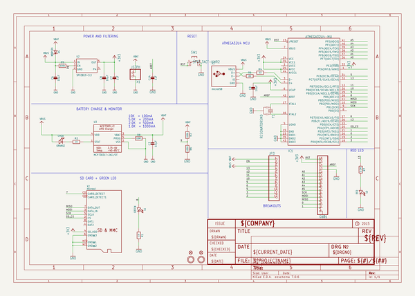
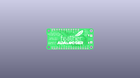
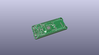
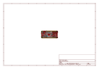
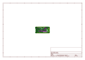
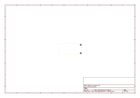
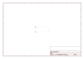
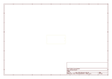
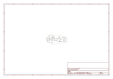

# OOMP Project  
## Adafruit-Feather-32u4-Adalogger-PCB  by adafruit  
  
(snippet of original readme)  
  
-- Adafruit Feather 32u4 Adalogger PCB  
<a href="http://www.adafruit.com/products/2795">   
Click here to purchase one from the Adafruit shop</a>  
  
This is the Adafruit Feather 32u4 Adalogger - our take on an 'all-in-one' datalogger (or data-reader) with built in USB and battery charging. Its an Adafruit Feather 32u4 with a microSD holder ready to rock! We have other boards in the Feather family, check'em out here  
  
At the Feather 32u4's heart is at ATmega32u4 clocked at 8 MHz and at 3.3V logic, a chip setup we've had tons of experience with as it's the same as the Flora. This chip has 32K of flash and 2K of RAM, with built in USB so not only does it have a USB-to-Serial program & debug capability built in with no need for an FTDI-like chip, it can also act like a mouse, keyboard, USB MIDI device, etc.  
  
PCB files for the Adafruit Feather 32u4 Adalogger. The format is EagleCAD schematic and board layout  
- https://www.adafruit.com/product/2795  
  
--- License  
  
Adafruit invests time and resources providing this open source design, please support Adafruit and open-source hardware by purchasing products from [Adafruit](https://www.adafruit.com)!  
  
All text above must be included in any redistribution  
  
Designed by Limor Fried/Ladyada for Adafruit Industries.  
Creative Commons Attribution/Share-Alike, all text above must be included in any redistribution.   
See license.txt for additional information.  
  
  full source readme at [readme_src.md](readme_src.md)  
  
source repo at: [https://github.com/adafruit/Adafruit-Feather-32u4-Adalogger-PCB](https://github.com/adafruit/Adafruit-Feather-32u4-Adalogger-PCB)  
## Board  
  
  
## Schematic  
  
  
  
[schematic pdf](working_schematic.pdf)  
## Images  
  
  
  
  
  
  
  
  
  
  
  
  
  
  
  
  
