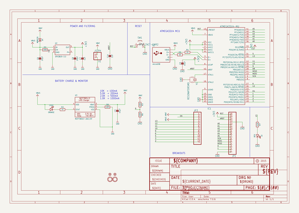
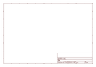

# OOMP Project  
## Adafruit-Feather-32u4-Basic-Proto-PCB  by adafruit  
  
oomp key: oomp_projects_flat_adafruit_adafruit_feather_32u4_basic_proto_pcb  
(snippet of original readme)  
  
-- Adafruit Feather 32u4 Basic Proto Microcontroller PCB  
<a href="http://www.adafruit.com/products/2771">   
Click here to purchase one from the Adafruit shop</a>  
  
The Feather 32u4 contains an ATmega32u4 clocked at 8 MHz and at 3.3V logic, a chip setup we've had tons of experience with as it's the same as the Flora. This chip has 32K of flash and 2K of RAM, with built in USB so not only does it have a USB-to-Serial program & debug capability built in with no need for an FTDI-like chip, it can also act like a mouse, keyboard, USB MIDI device, etc. This chip is well supported in the Arduino IDE and can run just about every sensor/library out there.  
  
To make it easy to use for portable projects, we added a connector for any of our 3.7V Lithium polymer batteries and built in battery charging. You don't need a battery, it will run just fine straight from the micro USB connector. But, if you do have a battery, you can take it on the go, then plug in the USB to recharge. The Feather will automatically switch over to USB power when its available. We also tied the battery thru a divider to an analog pin, so you can measure and monitor the battery voltage to detect when you need a recharge.  
  
PCB files for the Adafruit Feather 32u4 Basic Proto. The format is EagleCAD schematic and board layout  
- https://www.adafruit.com/product/2771  
  
--- License  
  
Adafruit invests time and resources providing this open source design, please support Ada  
  full source readme at [readme_src.md](readme_src.md)  
  
source repo at: [https://github.com/adafruit/Adafruit-Feather-32u4-Basic-Proto-PCB](https://github.com/adafruit/Adafruit-Feather-32u4-Basic-Proto-PCB)  
## Board  
  
  
## Schematic  
  
  
  
[schematic pdf](working_schematic.pdf)  
## Images  
  
  
  
  
  
  
  
  
  
  
  
  
  
  
  
  
