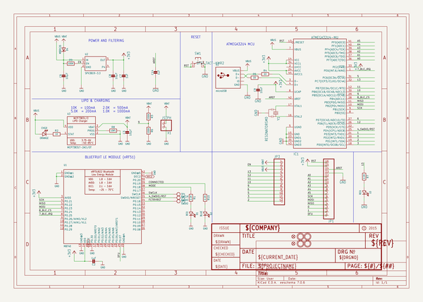

# OOMP Project  
## Adafruit-Feather-32u4-Bluefruit-LE-PCB  by adafruit  
  
oomp key: oomp_projects_flat_adafruit_adafruit_feather_32u4_bluefruit_le_pcb  
(snippet of original readme)  
  
-- Adafruit Feather 32u4 Bluefruit LE PCB  
  
<a href="http://www.adafruit.com/products/2829">   
Click here to purchase one from the Adafruit shop</a>  
  
PCB files for the Adafruit Feather 32u4 Bluefruit LE. Format is EagleCAD schematic and board layout  
  
For more details, check out the product page at  
* https://www.adafruit.com/product/2829  
  
--- Description  
  
Feather is the new development board from Adafruit, and like its namesake it is thin, light, and lets you fly! We designed Feather to be a new standard for portable microcontroller cores.  
  
This is the Adafruit Feather 32u4 Bluefruit - our take on an 'all-in-one' Arduino-compatible + Bluetooth Low Energy with built in USB and battery charging. Its an Adafruit Feather 32u4 with a BTLE module, ready to rock! We have other boards in the Feather family, check'em out here.  
  
Bluetooth Low Energy is the hottest new low-power, 2.4GHz spectrum wireless protocol. In particular, its the only wireless protocol that you can use with iOS without needing special certification and it's supported by all modern smart phones. This makes it excellent for use in portable projects that will make use of an iOS or Android phone or tablet. It also is supported in Mac OS X and Windows 8+.  
  
[We have quite a few BTLE-capable Feathers (it's a popular protocol!) so check out our BT Feather guide for some comparison information](https://learn.adafruit.com/adafruit-feather/bluetooth-feathers).  
  
At the Feat  
  full source readme at [readme_src.md](readme_src.md)  
  
source repo at: [https://github.com/adafruit/Adafruit-Feather-32u4-Bluefruit-LE-PCB](https://github.com/adafruit/Adafruit-Feather-32u4-Bluefruit-LE-PCB)  
## Board  
  
  
## Schematic  
  
  
  
[schematic pdf](working_schematic.pdf)  
## Images  
  
  
  
  
  
  
  
  
  
  
  
  
  
  
  
  
