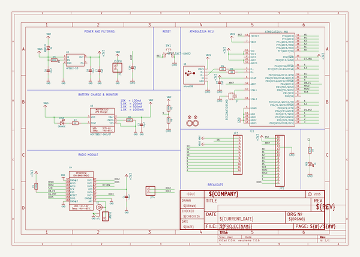

# OOMP Project  
## Adafruit-Feather-32u4-RFM-LoRa-PCB  by adafruit  
  
oomp key: oomp_projects_flat_adafruit_adafruit_feather_32u4_rfm_lora_pcb  
(snippet of original readme)  
  
-- Adafruit Feather 32u4 RFM LoRa Radios PCB  
  
   
Click below to purchase one from the Adafruit shop  
  
PCB files for the Adafruit Feather 32u4 RFM69 and LoRa Radio. Format is EagleCAD schematic and board layout  
  
For more details, check out the product pages at  
* RFM69HCW Packet Radio - 868 or 915 MHz https://www.adafruit.com/product/3076  
* RFM69HCW Packet Radio - 433MHz https://www.adafruit.com/product/3077  
* RFM95 LoRa Radio- 868 or 915 MHz https://www.adafruit.com/product/3078  
* RFM96 LoRa Radio - 433MHz https://www.adafruit.com/product/3079  
  
--- Description  
  
We call these RadioFruits, our take on an microcontroller packet radio transceiver with built in USB and battery charging. Its an Adafruit Feather 32u4 with a radio module cooked in! Great for making wireless networks that can go further than 2.4GHz 802.15.4 and similar, are more flexible than Bluetooth LE and without the high power requirements of WiFi.  
  
Feather is the new development board from Adafruit, and like its namesake it is thin, light, and lets you fly! We designed Feather to be a new standard for portable microcontroller cores.  
  
--- License  
  
Adafruit invests time and resources providing this open source design, please support Adafruit and open-source hardware by purchasing products from [Adafruit](https://www.adafruit.com)!  
  
Designed by Limor Fried/Ladyada for Adafruit Industries.  
  
Creative Commons Attribution/Share-Alike, all text above must be included i  
  full source readme at [readme_src.md](readme_src.md)  
  
source repo at: [https://github.com/adafruit/Adafruit-Feather-32u4-RFM-LoRa-PCB](https://github.com/adafruit/Adafruit-Feather-32u4-RFM-LoRa-PCB)  
## Board  
  
  
## Schematic  
  
  
  
[schematic pdf](working_schematic.pdf)  
## Images  
  
  
  
  
  
  
  
  
  
  
  
  
  
  
  
  
