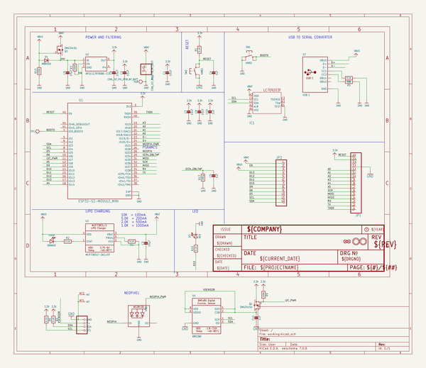
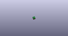

# OOMP Project  
## Adafruit-Feather-ESP32-S2-PCB  by adafruit  
  
oomp key: oomp_projects_flat_adafruit_adafruit_feather_esp32_s2_pcb  
(snippet of original readme)  
  
-- Adafruit ESP32-S2 Feather  
  
<a href="http://www.adafruit.com/products/5000">   
Click here to purchase one from the Adafruit shop</a>  
  
--- ESP32-S2 Feather with BME280  
  
<a href="http://www.adafruit.com/products/5303">   
Click here to purchase one from the Adafruit shop</a>  
  
PCB files for the Adafruit ESP32-S2 Feather   
  
Format is EagleCAD schematic and board layout  
* https://www.adafruit.com/product/5000  
* https://www.adafruit.com/product/5303  
  
--- Description  
  
What's Feather-shaped and has an ESP32-S2 WiFi module? What has a STEMMA QT connector for I2C devices? What has your favorite Espressif WiFi microcontroller and lots of Flash and RAM memory for your next IoT project? What will make your next IoT project flyyyyy?  
  
That's right - it's the new Adafruit ESP32-S2 Feather! With native USB and 4 MB flash + 2 MB of PSRAM, this board is perfect for use with CircuitPython or Arduino with low-cost WiFi. Native USB means it can act like a keyboard or a disk drive. WiFi means its awesome for IoT projects. And Feather means it works with the large community of Feather Wings for expandability.  
  
The ESP32-S2 is a highly-integrated, low-power, 2.4 GHz Wi-Fi System-on-Chip (SoC) solution that now has built-in native USB as well as some other interesting new technologies like Time of Flight distance measurements. With its state-of-the-art power and RF performance, this SoC is an idea  
  full source readme at [readme_src.md](readme_src.md)  
  
source repo at: [https://github.com/adafruit/Adafruit-Feather-ESP32-S2-PCB](https://github.com/adafruit/Adafruit-Feather-ESP32-S2-PCB)  
## Board  
  
  
## Schematic  
  
  
  
[schematic pdf](working_schematic.pdf)  
## Images  
  
  
  
  
  
  
  
  
  
  
  
  
  
  
  
  
