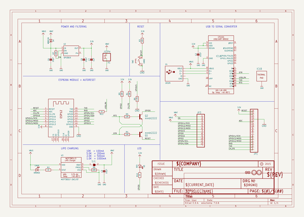

# OOMP Project  
## Adafruit-Feather-ESP8266-HUZZAH-PCB  by adafruit  
  
(snippet of original readme)  
  
-- Adafruit Feather HUZZAH with ESP8266 - Loose Headers PCB  
  
<a href="http://www.adafruit.com/products/2821">   
Click here to purchase one from the Adafruit shop</a>  
  
PCB files for the Adafruit Feather HUZZAH with ESP8266 - Loose Headers. Format is EagleCAD schematic and board layout  
* https://www.adafruit.com/product/2821  
  
--- Description  
  
Feather is the new development board from Adafruit, and like its namesake it is thin, light, and lets you fly! We designed Feather to be a new standard for portable microcontroller cores.  
  
This is the **Adafruit Feather HUZZAH ESP8266** - our take on an 'all-in-one' ESP8266 WiFi development board with built in USB and battery charging. Its an ESP8266 WiFi module with all the extras you need, ready to rock! [We have other boards in the Feather family, check'em out here.](https://www.adafruit.com/feather)  
  
At the Feather HUZZAH's heart is an ESP8266 WiFi microcontroller clocked at 80 MHz and at 3.3V logic. This microcontroller contains a Tensilica chip core as well as a full WiFi stack. You can program the microcontroller using the Arduino IDE for an easy-to-run Internet of Things core. We wired up a high-quality SiLabs CP2104 USB-Serial chip that can upload code at a blistering 921600 baud for fast development time. It also has auto-reset so no noodling with pins and reset button pressings. The CP2104 has better driver support than the CH340 and can do very high speeds without stability i  
  full source readme at [readme_src.md](readme_src.md)  
  
source repo at: [https://github.com/adafruit/Adafruit-Feather-ESP8266-HUZZAH-PCB](https://github.com/adafruit/Adafruit-Feather-ESP8266-HUZZAH-PCB)  
## Board  
  
  
## Schematic  
  
  
  
[schematic pdf](working_schematic.pdf)  
## Images  
  
  
  
  
  
  
  
  
  
  
  
  
  
  
  
  
