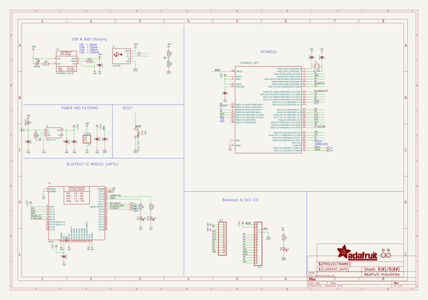
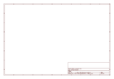
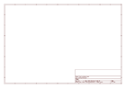

# OOMP Project  
## Adafruit-Feather-M0-Bluefruit-LE-PCB  by adafruit  
  
(snippet of original readme)  
  
-- Adafruit Feather M0 Bluefruit LE PCB  
<a href="http://www.adafruit.com/products/2995">   
Click here to purchase one from the Adafruit shop</a>  
  
This is the Adafruit Feather M0 Bluefruit LE - our take on an 'all-in-one' Arduino-compatible + Bluetooth Low Energy with built in USB and battery charging. It's an Adafruit Feather M0 with a BTLE module, ready to rock! We have other boards in the Feather family, check'em out here.  
  
Bluetooth Low Energy is a hot, low-power, 2.4GHz spectrum wireless protocol. In particular, it's the only wireless protocol that you can use with iOS without needing special certification, and it's supported by all modern smart phones. This makes it excellent for use in portable projects that will make use of an iOS or Android phone or tablet. It also is supported in Mac OS X and Windows 8+.  
  
At the Feather M0's heart is an ATSAMD21G18 ARM Cortex M0 processor, clocked at 48 MHz and at 3.3V logic, the same one used in the new Arduino Zero. This chip has a whopping 256K of FLASH (8x more than the Atmega328 or 32u4) and 32K of RAM (16x as much)! This chip comes with built in USB so it has USB-to-Serial program & debug capability built in with no need for an FTDI-like chip.  
  
PCB files for the Adafruit Feather M0 Bluefruit LE PCB. The format is EagleCAD schematic and board layout  
- https://www.adafruit.com/product/2995  
  
--- License  
  
Adafruit invests time and resources providing this open source design, ple  
  full source readme at [readme_src.md](readme_src.md)  
  
source repo at: [https://github.com/adafruit/Adafruit-Feather-M0-Bluefruit-LE-PCB](https://github.com/adafruit/Adafruit-Feather-M0-Bluefruit-LE-PCB)  
## Board  
  
  
## Schematic  
  
  
  
[schematic pdf](working_schematic.pdf)  
## Images  
  
  
  
  
  
  
  
  
  
  
  
  
  
  
  
  
