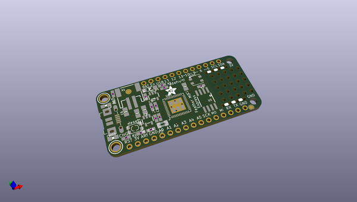
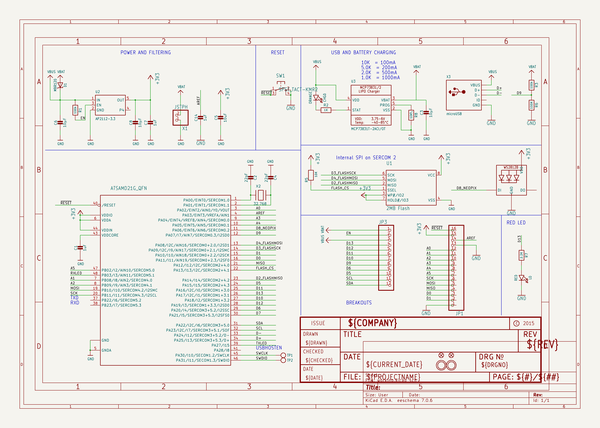
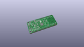
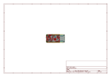
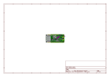
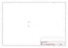
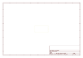
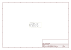

# OOMP Project  
## Adafruit-Feather-M0-Express-PCB  by adafruit  
  
oomp key: oomp_projects_flat_adafruit_adafruit_feather_m0_express_pcb  
(snippet of original readme)  
  
-- Adafruit Feather M0 Express - Designed for CircuitPython - ATSAMD21 Cortex M0 PCB  
  
<a href="http://www.adafruit.com/products/3403">   
Click here to purchase one from the Adafruit shop</a>  
  
PCB files for the Adafruit Feather M0 Express - Designed for CircuitPython - ATSAMD21 Cortex M0. Format is EagleCAD schematic and board layout  
* https://www.adafruit.com/product/3403  
  
--- Description  
  
We love all our Feathers equally, but this Feather is very special. It's our first Feather that is specifically designed for use with CircuitPython! CircuitPython is our beginner-oriented flavor of MicroPython - and as the name hints at, its a small but full-featured version of the popular Python programming language specifically for use with circuitry and electronics.  
  
Please note, CircuitPython does not come preloaded. See the full guide linked below for instructions on installing it.  
  
That doesn't mean you cant also use it with Arduino IDE! At the Feather M0's heart is an ATSAMD21G18 ARM Cortex M0+ processor, clocked at 48 MHz and at 3.3V logic, the same one used in the new [Arduino Zero](https://www.adafruit.com/products/2843). This chip has a whopping 256K of FLASH (8x more than the Atmega328 or 32u4) and 32K of RAM (16x as much)! This chip comes with built in USB so it has USB-to-Serial program & debug capability built in with no need for an FTDI-like chip.  
  
**Here's some handy specs!**  
 * Measures 2.0" x 0.9" x 0.28" (51mm x 23mm x  
  full source readme at [readme_src.md](readme_src.md)  
  
source repo at: [https://github.com/adafruit/Adafruit-Feather-M0-Express-PCB](https://github.com/adafruit/Adafruit-Feather-M0-Express-PCB)  
## Board  
  
  
## Schematic  
  
  
  
[schematic pdf](working_schematic.pdf)  
## Images  
  
  
  
  
  
  
  
  
  
  
  
  
  
  
  
  
