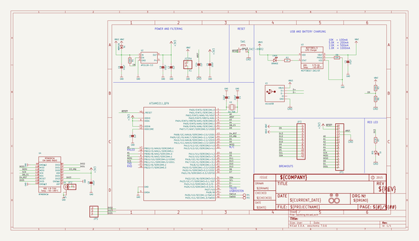

# OOMP Project  
## Adafruit-Feather-M0-RFM-LoRa-PCB  by adafruit  
  
(snippet of original readme)  
  
-- Adafruit Feather M0 RFM LoRa PCB  
&nbsp;    
Click to purchase from the Adafruit Shop:  
- [Adafruit Feather M0 with RFM95 LoRa Radio - 900MHz - RadioFruit](https://www.adafruit.com/product/3178)  
- [Adafruit Feather M0 RFM96 LoRa Radio - 433MHz - RadioFruit](https://www.adafruit.com/product/3179)  
  
This is the Adafruit Feather M0 RFM95 LoRa Radio (900MHz). We call these RadioFruits, our take on an microcontroller with a "Long Range (LoRa)" packet radio transceiver with built in USB and battery charging. Its an Adafruit Feather M0 with a 900MHz radio module cooked in! Great for making wireless networks that are more flexible than Bluetooth LE and without the high power requirements of WiFi.  
  
Feather is the new development board from Adafruit, and like its namesake it is thin, light, and lets you fly! We designed Feather to be a new standard for portable microcontroller cores.We have other boards in the Feather family, check'em out here.  
  
This is the 900 MHz radio version, which can be used for either 868MHz or 915MHz transmission/reception - the exact radio frequency is determined when you load the software since it can be tuned around dynamically. We also sell a 433MHz version of the same radio chipset!  
  
At the Feather M0's heart is an ATSAMD21G18 ARM Cortex M0 processor, c  
  full source readme at [readme_src.md](readme_src.md)  
  
source repo at: [https://github.com/adafruit/Adafruit-Feather-M0-RFM-LoRa-PCB](https://github.com/adafruit/Adafruit-Feather-M0-RFM-LoRa-PCB)  
## Board  
  
  
## Schematic  
  
  
  
[schematic pdf](working_schematic.pdf)  
## Images  
  
  
  
  
  
  
  
  
  
  
  
  
  
  
  
  
