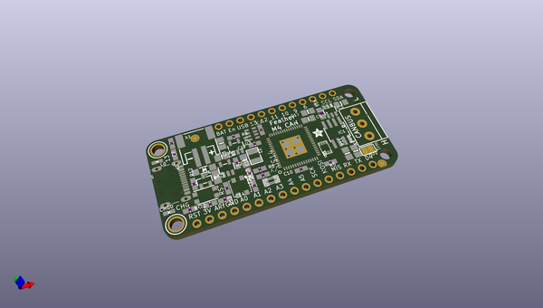
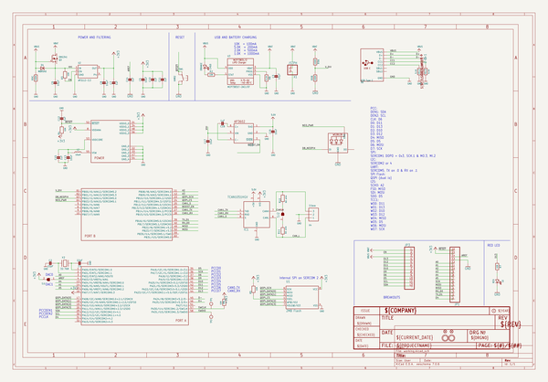
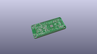
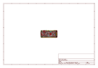
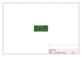
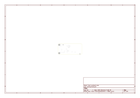
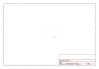
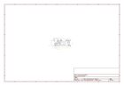

# OOMP Project  
## Adafruit-Feather-M4-CAN-PCB  by adafruit  
  
(snippet of original readme)  
  
-- Adafruit Feather M4 CAN Express PCB  
  
<a href="http://www.adafruit.com/products/4759">   
Click here to purchase one from the Adafruit shop</a>  
  
PCB files for the Adafruit Feather M4 CAN Express.  
  
Format is EagleCAD schematic and board layout  
* https://www.adafruit.com/product/4759  
  
--- Description  
  
One of our favorite Feathers, the Feather M4 Express, gets a glow-up here with an upgrade to the SAME51 chipset which has built-in CAN bus support!  Like its SAMD51 cousin, the ATSAME51J19 comes with a 120MHz Cortex M4 with floating point support and 512KB Flash and 192KB RAM. Your code will zig and zag and zoom, and with a bunch of extra peripherals for support, this will for sure be your favorite new chipset for CAN interfacing projects.  
  
At the end of the board we have placed a CAN transceiver chip as well as a 5V converter to generate 5V power to the transceiver even when running on battery. The two CAN signal lines and ground reference signal are available on a 3-pin 3.5mm terminal block. The chip and booster can be put to sleep for power saving. The built in CAN can read or write packets and has support in both Arduino and CircuitPython.  
  
And best of all, it's a Feather - so you know it will work with all our FeatherWings! What a great way to quickly get up and running. It's even pin-compatible with the original Feather M4.  
  
The most exciting part of the Feather M4 CAN is that while you can use it with the Arduino IDE - a  
  full source readme at [readme_src.md](readme_src.md)  
  
source repo at: [https://github.com/adafruit/Adafruit-Feather-M4-CAN-PCB](https://github.com/adafruit/Adafruit-Feather-M4-CAN-PCB)  
## Board  
  
  
## Schematic  
  
  
  
[schematic pdf](working_schematic.pdf)  
## Images  
  
  
  
  
  
  
  
  
  
  
  
  
  
  
  
  
