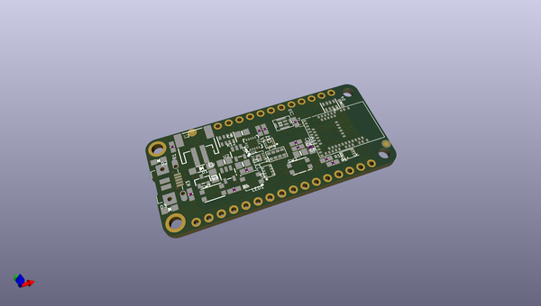
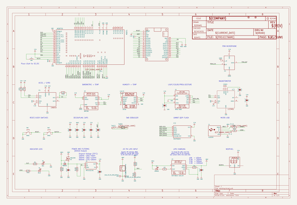
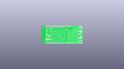
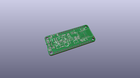
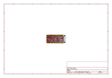
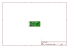
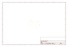
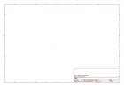
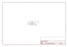

# OOMP Project  
## Adafruit-Feather-nRF52840-Sense-PCB  by adafruit  
  
oomp key: oomp_projects_flat_adafruit_adafruit_feather_nrf52840_sense_pcb  
(snippet of original readme)  
  
-- Adafruit Feather nRF52840 Sense PCB  
  
<a href="http://www.adafruit.com/products/4516">   
Click here to purchase one from the Adafruit shop</a>  
  
PCB files for the Adafruit Feather nRF52840 Sense.   
  
Format is EagleCAD schematic and board layout  
* https://www.adafruit.com/product/4516  
  
--- Description  
  
The Adafruit Feather Bluefruit Sense takes our popular Feather nRF52840 Express and adds a smorgasbord of sensors to make a great wireless sensor platform. This Feather microcontroller comes with Bluetooth Low Energy and native USB support featuring the nRF52840!  This Feather is an 'all-in-one' Arduino-compatible + Bluetooth Low Energy with built in USB plus battery charging. With native USB it works great with CircuitPython, too.  
  
Like the Feather nRF52840, this chip comes with Arduino IDE support - you can program the nRF52840 chip directly to take full advantage of the Cortex-M4 processor, and then calling into the Nordic SoftDevice radio stack when you need to communicate over BLE. Since the underlying API and peripherals are the same for the '832 and '840, you can supercharge your older nRF52832 projects with the same exact code, with a single recompile!  
  
This Feather is also a BLE-friendly CircuitPython board! CircuitPython works best with disk drive access, and this is the only BLE-plus-USB-native chip that has the memory to handle running a little Python interpreter. The massive RAM and speedy Cortex M4F chip make thi  
  full source readme at [readme_src.md](readme_src.md)  
  
source repo at: [https://github.com/adafruit/Adafruit-Feather-nRF52840-Sense-PCB](https://github.com/adafruit/Adafruit-Feather-nRF52840-Sense-PCB)  
## Board  
  
  
## Schematic  
  
  
  
[schematic pdf](working_schematic.pdf)  
## Images  
  
  
  
  
  
  
  
  
  
  
  
  
  
  
  
  
