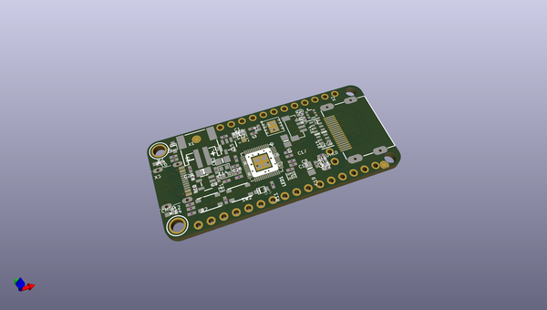
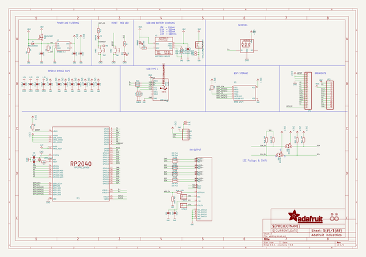
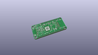
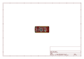
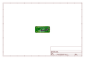
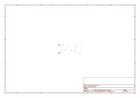
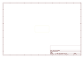
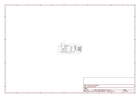

# OOMP Project  
## Adafruit-Feather-RP2040-DVI-PCB  by adafruit  
  
oomp key: oomp_projects_flat_adafruit_adafruit_feather_rp2040_dvi_pcb  
(snippet of original readme)  
  
-- Adafruit Feather RP2040 DVI PCB  
  
<a href="http://www.adafruit.com/products/5710">   
Click here to purchase one from the Adafruit shop</a>  
  
PCB files for the Adafruit Feather RP2040 DVI.   
  
Format is EagleCAD schematic and board layout  
* https://www.adafruit.com/product/5710  
  
--- Description  
  
Wouldn't it be cool if you could display images and graphics from a microcontroller directly to an HDMI monitor or television? We think so! So we designed this RP2040 Feather that has a digital video output (a.k.a DVI) that will work with any HDMI monitor or display. Note it doesn't do audio, just graphics!  
  
It's kinda like we took our RP2040 Feather and DVI Breakout board and glued them together. You get all the pins for use on the Feather, the Lipoly battery support, USB C power / data, onboard NeoPixel, 8MB of FLASH for storing code and files, and then with the 8 unused pins, a DVI output that can be used with the PicoDVI library in Arduino or Pico SDK (note we don't have Circuitpython support for DVI output at this time)  
  
In Arduino, which is what we recommend, we use our fork of PicoDVI to create an internal framebuffer of 320x240 or 400x240 16-bit pixels that is then continuously blitted out as pixel-doubled 640x480 or 800x480 digital video. Whatever you 'draw' to the internal memory framebuffer appears instantly on the digital display in crisp color. Since the library is a subclass of AdafruitGFX, it'll be familiar to folks who  
  full source readme at [readme_src.md](readme_src.md)  
  
source repo at: [https://github.com/adafruit/Adafruit-Feather-RP2040-DVI-PCB](https://github.com/adafruit/Adafruit-Feather-RP2040-DVI-PCB)  
## Board  
  
  
## Schematic  
  
  
  
[schematic pdf](working_schematic.pdf)  
## Images  
  
  
  
  
  
  
  
  
  
  
  
  
  
  
  
  
