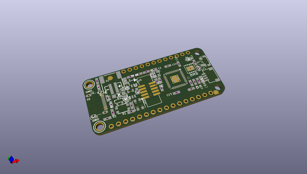
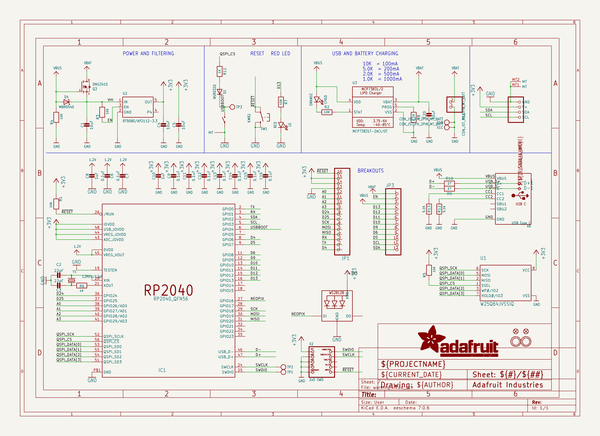
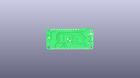
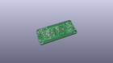
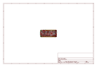
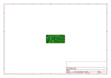
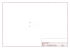
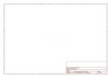
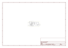

# OOMP Project  
## Adafruit-Feather-RP2040-PCB  by adafruit  
  
oomp key: oomp_projects_flat_adafruit_adafruit_feather_rp2040_pcb  
(snippet of original readme)  
  
- Adafruit-Feather-RP2040-PCB  
  
  
  
Open source PCB files for Feather RP2040  
  
PCB format is EagleCAD schematic and board layout  
  
For more details, check out the product pages at  
  
   * https://www.adafruit.com/products/4884  
  
**We are releasing these files so folks can start creating custom designs based on the RP2040 chip. This design has been built and tested successfully**  
  
Adafruit invests time and resources providing this open source design,   
please support Adafruit and open-source hardware by purchasing   
products from Adafruit!  
  
Designed by Adafruit Industries.    
Creative Commons Attribution, Share-Alike license, check license.txt for more information  
All text above must be included in any redistribution  
  
  full source readme at [readme_src.md](readme_src.md)  
  
source repo at: [https://github.com/adafruit/Adafruit-Feather-RP2040-PCB](https://github.com/adafruit/Adafruit-Feather-RP2040-PCB)  
## Board  
  
  
## Schematic  
  
  
  
[schematic pdf](working_schematic.pdf)  
## Images  
  
  
  
  
  
  
  
  
  
  
  
  
  
  
  
  
