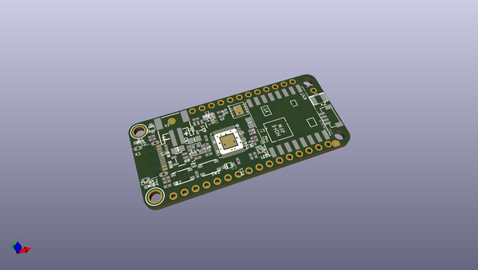
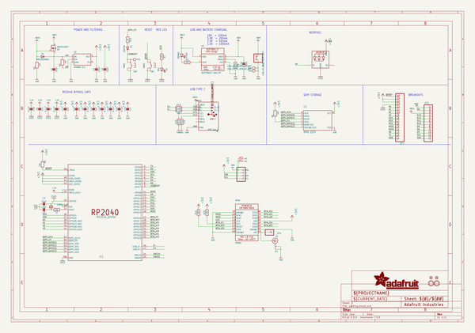
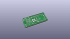
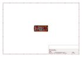
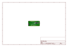
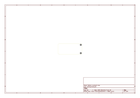
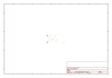
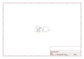

# OOMP Project  
## Adafruit-Feather-RP2040-RFM-PCB  by adafruit  
  
(snippet of original readme)  
  
-- Adafruit Feather RP2040 RFM PCB  
  
<a href="http://www.adafruit.com/products/5712">   
<a href="http://www.adafruit.com/products/5714">   
Click here to purchase one from the Adafruit shop</a>  
  
PCB files for the Adafruit Feather RP2040 RFM69 and RFM9x. The board files are identical for both  
types of radio modules!  
  
Format is EagleCAD schematic and board layout  
* https://www.adafruit.com/product/5712  
  
--- Description  
  
This is the Adafruit Feather RP2040 RFM. We call these RadioFruits, our take on a microcontroller with packet radio transceiver with built-in USB and battery charging. It's an Adafruit Feather RP2040 with a radio module cooked in! Great for making wireless networks that are more flexible than Bluetooth LE and without the high power requirements of WiFi.  
  
Feather is the development board specification from Adafruit, and like its namesake, it is thin, light, and lets you fly! We designed Feather to be a new standard for portable microcontroller cores. We have other boards in the Feather family, check'em out here.  
  
It's kinda like we took our RP2040 Feather and an RFM breakout board and glued them together. You get all the pins for use on the Feather, the Lipoly battery support, USB C power / data, onboard NeoPixel, 8MB of FLASH for storing code and files, and then with the 8 unused pins, we wired up all the DIO pins on the RFM module. There's even room left over  
  full source readme at [readme_src.md](readme_src.md)  
  
source repo at: [https://github.com/adafruit/Adafruit-Feather-RP2040-RFM-PCB](https://github.com/adafruit/Adafruit-Feather-RP2040-RFM-PCB)  
## Board  
  
  
## Schematic  
  
  
  
[schematic pdf](working_schematic.pdf)  
## Images  
  
  
  
  
  
  
  
  
  
  
  
  
  
  
  
  
