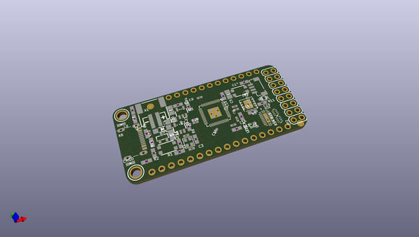
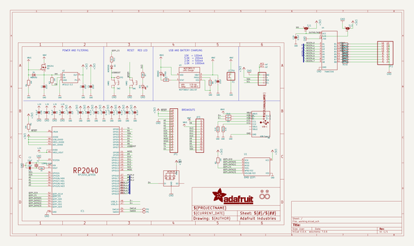
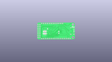
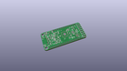
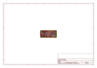
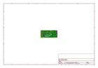
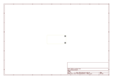
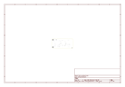
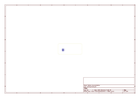
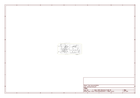

# OOMP Project  
## Adafruit-Feather-RP2040-SCORPIO-PCB  by adafruit  
  
(snippet of original readme)  
  
-- Adafruit Feather RP2040 SCORPIO 8 Channel NeoPixel Driver PCB  
  
<a href="http://www.adafruit.com/products/5650">   
Click here to purchase one from the Adafruit shop</a>  
  
PCB files for the Adafruit Feather RP2040 SCORPIO 8 Channel NeoPixel Driver.   
  
Format is EagleCAD schematic and board layout  
* https://www.adafruit.com/product/5650  
  
--- Description  
  
If there is one thing Adafruit is known for, its mega-blinky-fun-rainbow-LEDs. We just love sticking NeoPixels anywhere and everywhere. When we saw the new 'PIO' peripheral on the RP2040 from Raspberry Pi, we just knew it would be perfect for driving large quantities of NeoPixels. So we created this board, the Adafruit Feather RP2040 SCORPIO, designed specifically for NeoPixel (WS2812) driving but also good for various other PIO-based projects that want to take advantage of the Feather pinout with 8 separate consecutive outputs (or inputs).  
  
The RP2040 PIO state machine is perfect for LED driving: it can generate perfect waveforms, with up to 8 outputs concurrently, all through DMA. That means that you don't need to use any processor time to bit-bang-out the LED data. Just set up the buffer and tell the PIO peripheral to 'make it so' and it will shove that data to the 8 outputs without delay while your code can continue to read buttons, play music, run CircuitPython - whatever you like!  
  
The SCORPIO has a clever pinout, where all the standard Feather pins are the same as the   
  full source readme at [readme_src.md](readme_src.md)  
  
source repo at: [https://github.com/adafruit/Adafruit-Feather-RP2040-SCORPIO-PCB](https://github.com/adafruit/Adafruit-Feather-RP2040-SCORPIO-PCB)  
## Board  
  
  
## Schematic  
  
  
  
[schematic pdf](working_schematic.pdf)  
## Images  
  
  
  
  
  
  
  
  
  
  
  
  
  
  
  
  
