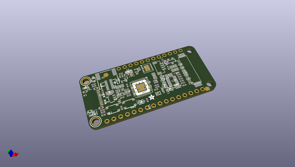
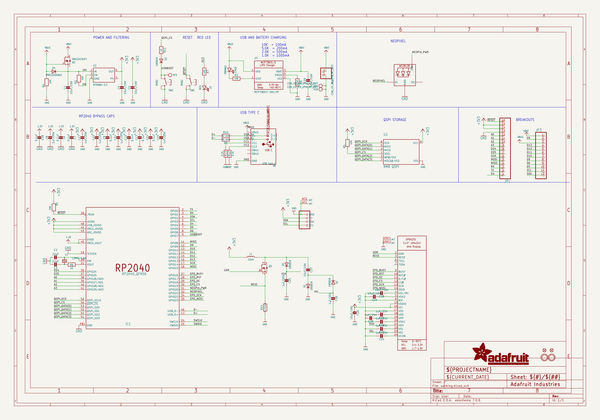
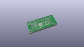
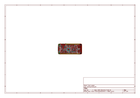
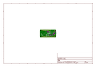
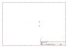
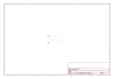
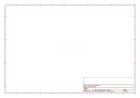
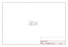

# OOMP Project  
## Adafruit-Feather-RP2040-ThinkInk  by adafruit  
  
oomp key: oomp_projects_flat_adafruit_adafruit_feather_rp2040_thinkink  
(snippet of original readme)  
  
-- Adafruit Feather RP2040 ThinkInk with 24-pin E-Paper Display - STEMMA QT PCB  
  
<a href="http://www.adafruit.com/products/5727">   
Click here to purchase one from the Adafruit shop</a>  
  
PCB files for the Adafruit Feather RP2040 ThinkInk with 24-pin E-Paper Display - STEMMA QT.   
  
Format is EagleCAD schematic and board layout  
* https://www.adafruit.com/product/5727  
  
--- Description  
  
Easy e-paper and RP2040 finally come to your Feather with this Adafruit RP2040 Feather Think Ink that's designed to make it a breeze to add almost any common e-Ink/e-Paper display. Chances are you've seen one of those new-fangled 'e-readers' like the Kindle or Nook. They have gigantic electronic paper 'static' displays - that means the image stays on the display even when power is completely disconnected. The image is also high contrast and very daylight readable. It really does look just like printed paper!  
  
We've liked these displays for a long time, and we've got Arduino/CircuitPython drivers for tons of the various display chipsets, so wouldn't an e-paper RP2040 Feather make a ton of sense? Luckily for us, just about every small-medium size EInk display made these days has a standard 24-pin connection. This Feather will add all the power supply support circuitry and level shifting so you can attach your favorite display - we've tested it with up to 5.6" sized 7-color ACeP displays.  
  
Since all ePaper displays with the 24-pin interface require   
  full source readme at [readme_src.md](readme_src.md)  
  
source repo at: [https://github.com/adafruit/Adafruit-Feather-RP2040-ThinkInk](https://github.com/adafruit/Adafruit-Feather-RP2040-ThinkInk)  
## Board  
  
  
## Schematic  
  
  
  
[schematic pdf](working_schematic.pdf)  
## Images  
  
  
  
  
  
  
  
  
  
  
  
  
  
  
  
  
