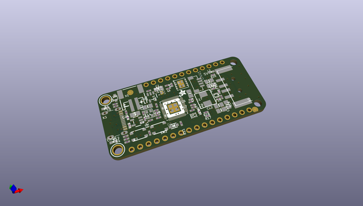

# OOMP Project  
## Adafruit-Feather-RP2040-USB-Host-PCB  by adafruit  
  
(snippet of original readme)  
  
-- Adafruit Feather RP2040 with USB Host PCB  
  
<a href="http://www.adafruit.com/products/5723">   
Click here to purchase one from the Adafruit shop</a>  
  
PCB files for the Adafruit Feather RP2040 with USB Host.   
  
Format is EagleCAD schematic and board layout  
* https://www.adafruit.com/product/5723  
  
--- Description  
  
You're probably really used to microcontroller boards with USB, but what about a dev board with two? Two is more than one, so that makes it twice as good! And the Adafruit Feather RP2040 with USB Host is definitely double-the-fun of our other Feather RP2040 boards, with a USB Type A port on the end for connecting USB devices to.   
  
Now you might be thinking "hey waitaminute, the RP2040 doesn't have two USB port peripherals???" and you'd be correct! But what it does have is a nifty PIO peripheral that can be (ab)used to emulate a USB host peripheral. You get to keep the main USB port for uploading, debugging, and data communication, while at the same time sending and receiving data to just-about-any USB device. [This work is originally by sekigon on GitHub](https://github.com/sekigon-gonnoc/Pico-PIO-USB), and if you're using Pico SDK that's still the recommended library to use.  
  
Currently, support for the USB Host peripheral is only in Arduino. So check out the [TinyUSB 'dual role' examples](https://github.com/adafruit/Adafruit_TinyUSB_Arduino/tree/master/examples/DualRole) for some things you can do! For example, [d  
  full source readme at [readme_src.md](readme_src.md)  
  
source repo at: [https://github.com/adafruit/Adafruit-Feather-RP2040-USB-Host-PCB](https://github.com/adafruit/Adafruit-Feather-RP2040-USB-Host-PCB)  
## Board  
  
  
## Schematic  
  
  
  
[schematic pdf](working_schematic.pdf)  
## Images  
