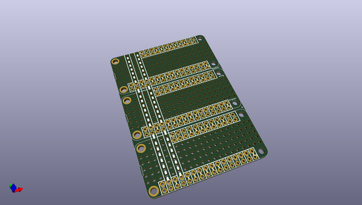
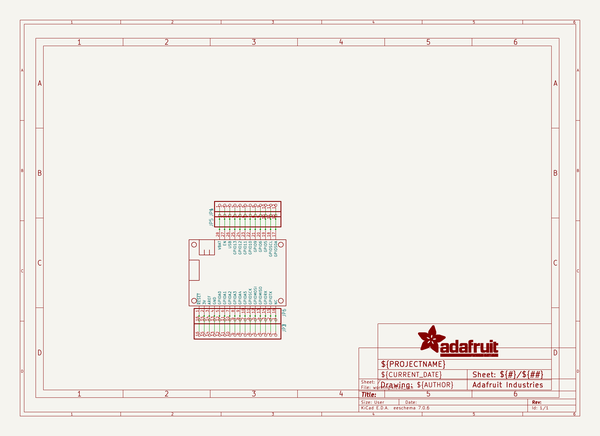
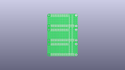
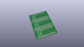
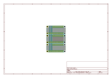
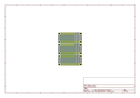
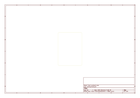
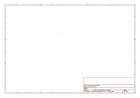
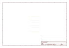

# OOMP Project  
## Adafruit-FeatherWing-Proto-Doubler-Tripler-and-Quad  by adafruit  
  
oomp key: oomp_projects_flat_adafruit_adafruit_featherwing_proto_doubler_tripler_and_quad  
(snippet of original readme)  
  
-- FeatherWing Proto, Doubler, Tripler and Quad PCBs  
  
   
   
   
   
&nbsp;   
  
Click the picture or one of the links below to purchase from the Adafruit shop  
  
PCB files for the Adafruit Feather Wing Proto, Doubler, Tripler and Quad  
  
Format is EagleCAD schematic and board layout   
  
Click to order the boards of your choice  
 * FeatherWing Proto https://www.adafruit.com/products/2884  
 * FeatherWing Doubler https://www.adafruit.com/products/2890  
 * FeatherWing Tripler https://www.adafruit.com/products/3417  
 * FeatherWing Quad 2x2 https://www.adafruit.com/product/4253  
 * FeatherWing Quad Side by Side https://www.adafruit.com/product/4254  
  
--- Description  
  
These are the FeatherWing Proto, Doubler, Tripler and Quad - prototyping add-ons for all Feather boards. Using our [Feather Stacking Headers](https://www.adafruit.com/products/2830) or [Feather Female Headers](http://www.adafruit.com/products/2886) you can connect a FeatherWing on top or bottom of your Feather board and let  
  full source readme at [readme_src.md](readme_src.md)  
  
source repo at: [https://github.com/adafruit/Adafruit-FeatherWing-Proto-Doubler-Tripler-and-Quad](https://github.com/adafruit/Adafruit-FeatherWing-Proto-Doubler-Tripler-and-Quad)  
## Board  
  
  
## Schematic  
  
  
  
[schematic pdf](working_schematic.pdf)  
## Images  
  
  
  
  
  
  
  
  
  
  
  
  
  
  
  
  
