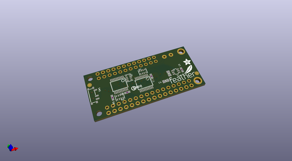
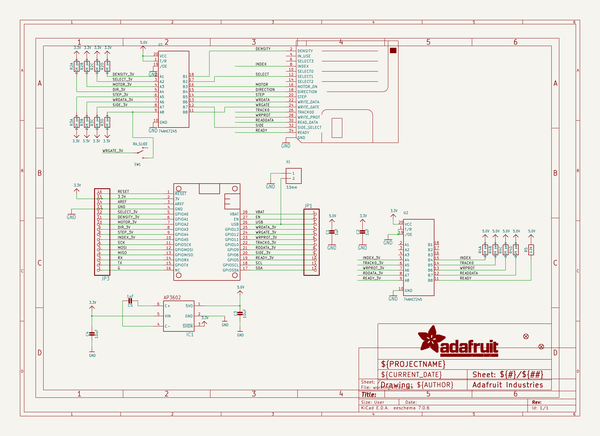
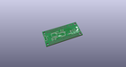
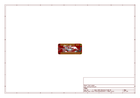
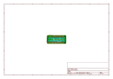
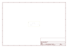
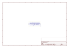
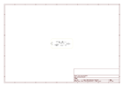

# OOMP Project  
## Adafruit_Floppy_FeatherWing_PCB  by adafruit  
  
oomp key: oomp_projects_flat_adafruit_adafruit_floppy_featherwing_pcb  
(snippet of original readme)  
  
-- Adafruit Floppy FeatherWing with 34-Pin IDC Connector PCB  
  
<a href="http://www.adafruit.com/products/5679">   
Click here to purchase one from the Adafruit shop</a>  
  
PCB files for the Adafruit Floppy FeatherWing with 34-Pin IDC Connector.   
  
Format is EagleCAD schematic and board layout  
* https://www.adafruit.com/product/5679  
  
--- Description  
  
Relive the days when storage was counted out in kilo-bytes not giga-bytes, using the Adafruit Floppy FeatherWing on a Feather board - perfect for interfacing with 34-Pin IDC Connector floppy drives that were ubiquitous on PC's. This 'Wing has level shifting and a ready-to-plug connector that works with 3.5" or 5.25" floppy disks for reading or writing!  
  
Floppy disks have an interesting data transfer method where raw bit transitions are measured and converted to data. This data streams pretty fast from the disk drive so you'll want to use a fast microcontroller that has large SRAM storage and ideally, a peripheral to DMA the data signal. For that reason we only have this FeatherWing working with the Feather M4 or Feather RP2040. ESP32, ATmega, nRF52, etc have not been ported to our support library!  
  
Floppy disk drives require 5V power and logic. For the logic level shifting, we have a small boost converter on the 'Wing that will give 5V logic levels out the 34-pin connector. It will also shift the incoming signals down to a Feather-safe 3.3V.  
  
For floppy driver powering you will li  
  full source readme at [readme_src.md](readme_src.md)  
  
source repo at: [https://github.com/adafruit/Adafruit_Floppy_FeatherWing_PCB](https://github.com/adafruit/Adafruit_Floppy_FeatherWing_PCB)  
## Board  
  
  
## Schematic  
  
  
  
[schematic pdf](working_schematic.pdf)  
## Images  
  
  
  
  
  
  
  
  
  
  
  
  
  
  
  
  
