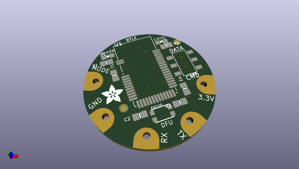
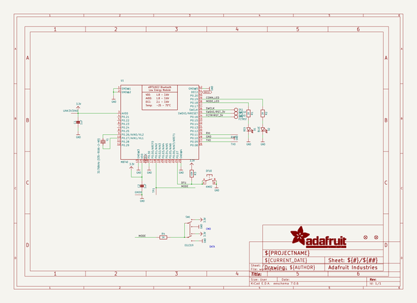
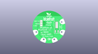
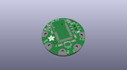
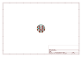
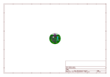
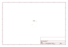
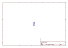
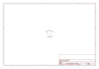

# OOMP Project  
## Adafruit-Flora-Bluefruit-LE-PCB  by adafruit  
  
(snippet of original readme)  
  
-- Adafruit Flora Bluefruit LE PCB  
<a href="http://www.adafruit.com/products/2487">   
Click here to purchase one from the Adafruit shop</a>  
  
Would you like to add powerful and easy-to-use Bluetooth Low Energy to your wearable FLORA project? Heck yeah! With BLE now included in modern smart phones and tablets, its fun to add wireless connectivity. So what you really need is the new Adafruit Flora Bluefruit LE!  
  
The Flora Bluefruit LE makes it easy to add Bluetooth Low Energy connectivity to your Flora. Sew 4 traces (or solder 4 wires) and BooM! Bluetooth Low Energy!  
  
Get started fast with the Bluefruit App!  
  
Using our Bluefruit iOS App or Android App, you can quickly get your interactive project prototyped by using your iOS or Android phone/tablet as a controller. We have a color picker, quaternion/accelerometer/gyro/magnetometer or location (GPS), and an 8-button control game pad. After you connect to the Bluefruit, you can send commands wirelessly in under 10 minutes  
  
PCB files for the Adafruit Bluefruit LE PCB. The format is EagleCAD schematic and board layout  
- https://www.adafruit.com/product/2487  
  
--- License  
  
Adafruit invests time and resources providing this open source design, please support Adafruit and open-source hardware by purchasing products from [Adafruit](https://www.adafruit.com)!  
  
All text above must be included in any redistribution  
  
Designed by Limor Fried/Ladyada for Adafruit Industries.  
Creative Common  
  full source readme at [readme_src.md](readme_src.md)  
  
source repo at: [https://github.com/adafruit/Adafruit-Flora-Bluefruit-LE-PCB](https://github.com/adafruit/Adafruit-Flora-Bluefruit-LE-PCB)  
## Board  
  
  
## Schematic  
  
  
  
[schematic pdf](working_schematic.pdf)  
## Images  
  
  
  
  
  
  
  
  
  
  
  
  
  
  
  
  
