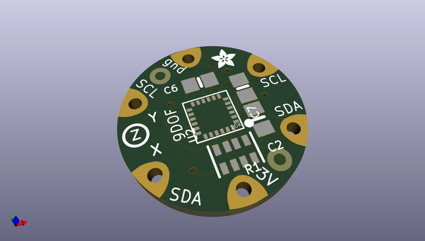
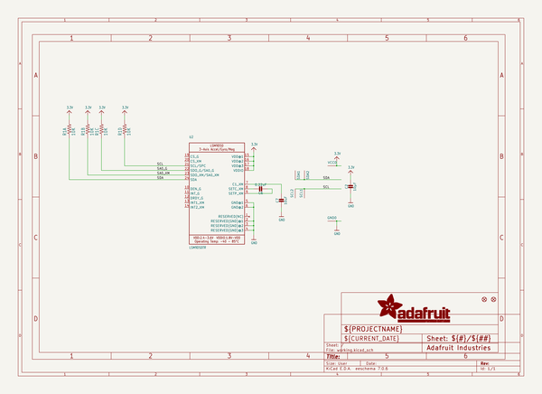
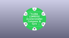
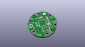
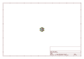
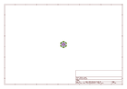
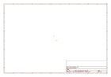
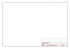
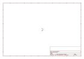

# OOMP Project  
## Adafruit-Flora-LSM9DS0-9DOF-PCB  by adafruit  
  
oomp key: oomp_projects_flat_adafruit_adafruit_flora_lsm9ds0_9dof_pcb  
(snippet of original readme)  
  
- Adafruit Flora LSM9DS0 9DOF PCB  
<a href="http://www.adafruit.com/products/2020">   
Click here to purchase one from the Adafruit shop</a>  
  
Add motion, direction and orientation sensing to your wearable FLORA project with this high precision 9-DOF sensors. Inside are three sensors, one is a classic 3-axis accelerometer, which can tell you which direction is down towards the Earth (by measuring gravity) or how fast the board is accelerating in 3D space. The other is a 3-axis magnetometer that can sense where the strongest magnetic force is coming from, generally used to detect magnetic north.  The third is a 3-axis gyroscope that can measure spin and twist.  By combining this data you can REALLY orient yourself.  
  
When we saw the new LSM9DS0 from ST micro we thought - wow this could really make some wearables super smart. Design your own activity or motion tracker with all the data! The sensor has a digital (I2C) interface. Attaching it to the FLORA is simple: line up the sensor so its adjacent to the SDA/SCL pins and sew conductive thread from the 3V, SDA, SCL and GND pins. They line up perfectly so you will not have any crossed lines. You can only connect one of these sensors to your FLORA, but you can connect other I2C sensors/outputs by using the set of SCL/SDA pins on the opposite side.  
  
PCB files for Adafruit Flora LSM9DS0 9-DOF Sensor PCB. The format is EagleCAD schematic and board layout  
- https://www.adafruit.com/pr  
  full source readme at [readme_src.md](readme_src.md)  
  
source repo at: [https://github.com/adafruit/Adafruit-Flora-LSM9DS0-9DOF-PCB](https://github.com/adafruit/Adafruit-Flora-LSM9DS0-9DOF-PCB)  
## Board  
  
  
## Schematic  
  
  
  
[schematic pdf](working_schematic.pdf)  
## Images  
  
  
  
  
  
  
  
  
  
  
  
  
  
  
  
  
