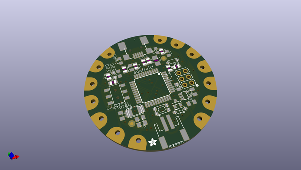
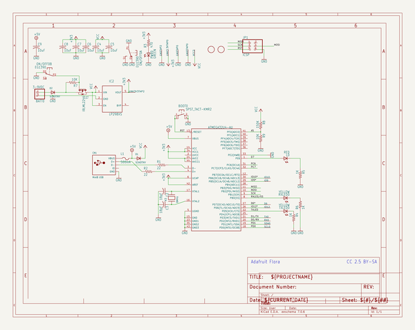
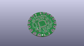
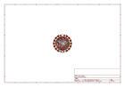
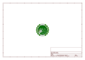
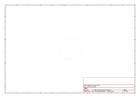
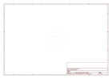
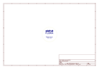
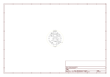

# OOMP Project  
## Adafruit-Flora-Mainboard  by adafruit  
  
(snippet of original readme)  
  
- Adafruit Flora Mainboard PCB Files  
<a href="http://www.adafruit.com/products/659">   
Click here to purchase one from the Adafruit shop</a>  
  
FLORA is Adafruit's fully-featured wearable electronics platform. It's a round, sewable, Arduino-compatible microcontroller designed to empower amazing wearables projects.FLORA comes with Adafruit's support, tutorials and projects. Check out dozens of FLORA tutorials on the Adafruit Learning System, with more added all the time!  
  
The FLORA is small (1.75" diameter, weighing 4.4 grams). The FLORA family also has the best stainless steel threads, sensors, GPS modules and chainable LED NeoPixels, perfect accessories for the FLORA main board.   
  
The FLORA has built-in USB support. Built in USB means you plug it in to program it, it just shows up - all you need is a Micro-B USB cable, no additional purchases are needed! We have a modified version of the Arduino IDE so Mac & Windows users can get started fast - or with the new 1.6.4+ Arduino IDE, it takes only a few seconds to add Flora-support. The FLORA has USB HID support, so it can act like a mouse or keyboard to attach directly to computers.  
  
This is the PCB for the Adafruit Flora Mainboard. The format is EagleCAD schematic and board layout  
- http://adafruit.com/products/659  
  
--- License  
  
Adafruit invests time and resources providing this open source design, please support Adafruit and open-source hardware by purchasing products from [Ad  
  full source readme at [readme_src.md](readme_src.md)  
  
source repo at: [https://github.com/adafruit/Adafruit-Flora-Mainboard](https://github.com/adafruit/Adafruit-Flora-Mainboard)  
## Board  
  
  
## Schematic  
  
  
  
[schematic pdf](working_schematic.pdf)  
## Images  
  
  
  
  
  
  
  
  
  
  
  
  
  
  
  
  
