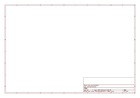

# OOMP Project  
## Adafruit-Flora-Sewable-3-Pin-JST-Wiring-Adapter-PCB  by adafruit  
  
oomp key: oomp_projects_flat_adafruit_adafruit_flora_sewable_3_pin_jst_wiring_adapter_pcb  
(snippet of original readme)  
  
-- Adafruit Flora Sewable 3-Pin JST Wiring Adapter PCB  
<a href="http://www.adafruit.com/products/2566">   
Click here to purchase one from the Adafruit shop</a>  
  
This board is a sewable adapter with a 3-pin JST wiring adapter.  It's a perfect way to add a simple link between things like our Flora NeoPixels and more complicated products like our NeoPixel Rings.  There are three holes on the board that are perfect for conductive thread (or soldering if you so choose), wired to a single 3-pin JST-PH Adapter.  
  
We also include a 3-pin JST-PH cable.  This product only includes the assembled sew-tap board with the 3-wire JST cable assembly.  Does not include Flora NeoPixels or Flora!  
  
PCB files for the Adafruit Flora Sewable 3-Pin JST Wiring Adapter. The format is EagleCAD schematic and board layout  
- http://adafruit.com/products/2566  
  
--- License  
  
Adafruit invests time and resources providing this open source design, please support Adafruit and open-source hardware by purchasing products from [Adafruit](https://www.adafruit.com)!  
  
All text above must be included in any redistribution  
  
Designed by Limor Fried/Ladyada for Adafruit Industries.  
Creative Commons Attribution/Share-Alike, all text above must be included in any redistribution.   
See license.txt for additional information.  
  
  full source readme at [readme_src.md](readme_src.md)  
  
source repo at: [https://github.com/adafruit/Adafruit-Flora-Sewable-3-Pin-JST-Wiring-Adapter-PCB](https://github.com/adafruit/Adafruit-Flora-Sewable-3-Pin-JST-Wiring-Adapter-PCB)  
## Board  
  
  
## Schematic  
  
  
  
[schematic pdf](working_schematic.pdf)  
## Images  
  
  
  
  
  
  
  
  
  
  
  
  
  
  
  
  
