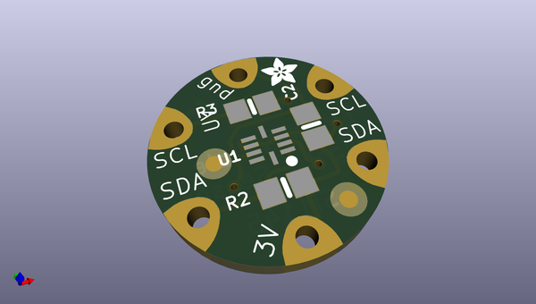
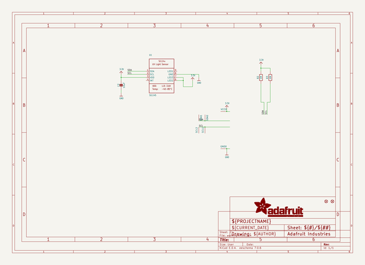
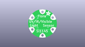
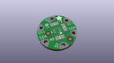
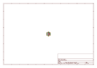
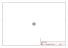
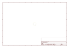
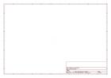
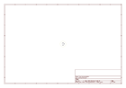

# OOMP Project  
## Adafruit-Flora-Si1145-Light-Sensor-PCB  by adafruit  
  
oomp key: oomp_projects_flat_adafruit_adafruit_flora_si1145_light_sensor_pcb  
(snippet of original readme)  
  
-- Adafruit Flora Si1145 Light Sensor PCB  
<a href="http://www.adafruit.com/products/1981">   
Click here to purchase one from the Adafruit shop</a>  
  
Your wearable can now keep you from getting sunburnt, with the Flora digital UV index sensor. We took our popular SI1145 UV index sensor and cut out everything you don't need for using with our wearable platforms: Flora and Gemma M0. It's small, round, and connects to the I2C bus pads. Flora and Gemma M0 can even use our library code to get calibrated light level and UV index data from the sensor.  
  
Please note: this sensor can be used by <a href="https://www.adafruit.com/product/659">Flora</a> and <a href="https://www.adafruit.com/product/3501">Gemma M0</a> but is too complex for <a href="https://www.adafruit.com/product/1222">Gemma v2 (ATtiny85)</a>!  
  
PCB files for the Adafruit Flora Si1145 Light Sensor. The format is EagleCAD schematic and board layout  
- https://www.adafruit.com/product/1981  
  
--- License  
  
Adafruit invests time and resources providing this open source design, please support Adafruit and open-source hardware by purchasing products from [Adafruit](https://www.adafruit.com)!  
  
All text above must be included in any redistribution  
  
Designed by Limor Fried/Ladyada for Adafruit Industries.  
Creative Commons Attribution/Share-Alike, all text above must be included in any redistribution.   
See license.txt for additional information.  
  
  full source readme at [readme_src.md](readme_src.md)  
  
source repo at: [https://github.com/adafruit/Adafruit-Flora-Si1145-Light-Sensor-PCB](https://github.com/adafruit/Adafruit-Flora-Si1145-Light-Sensor-PCB)  
## Board  
  
  
## Schematic  
  
  
  
[schematic pdf](working_schematic.pdf)  
## Images  
  
  
  
  
  
  
  
  
  
  
  
  
  
  
  
  
