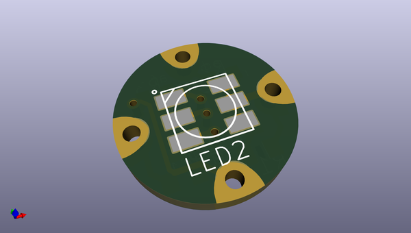
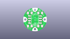
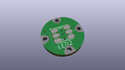
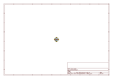
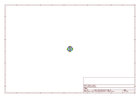
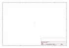
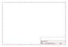
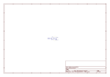
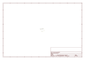

# OOMP Project  
## Adafruit-Flora-Smart-NeoPixel  by adafruit  
  
(snippet of original readme)  
  
- PCB for the Adafruit Flora Smart NeoPixels  
  
<a href="http://www.adafruit.com/products/1060"> Click here to purchase one from the Adafruit shop</a>  
  
__Format is EagleCAD schematic and board layout__  
  
What's a wearable project without LEDs? Our favorite part of the Flora platform is these tiny smart pixels. Designed specifically for wearables, [we found the brightest RGB LEDs available (an eye-blistering ~3800mcd)](http://adafruit.com/products/619) and paired them with a constant-current driver chip that sits on the back. The pixels are chainable - so you only need 1 pin/wire to control as many LEDs as you like. They're easy to sew, and the chainable design means no crossed threads.  
  
__This is the first/original version of the Flora NeoPixels, which runs at at 'low speed' 400KHz communication.__ Unfortunately they are not forward-compatible with [the fully-integrated 'high speed' (800KHz) Flora NeoPixel V2's](http://www.adafruit.com/products/1260). If you have a project that already uses high speed pixels, and you want to attach more pixels to the chain, [you will need to purchase version 2's](http://www.adafruit.com/products/1260) as these are not cross-compatible. __If you don't have any pixels in your project yet, [we suggest purchasing v2 pixels](http://www.adafruit.com/products/1260) as they are lower cost and v1's will eventually be discontinued.__  
  
These pixels have full 24-bit color ability with PWM taken care of   
  full source readme at [readme_src.md](readme_src.md)  
  
source repo at: [https://github.com/adafruit/Adafruit-Flora-Smart-NeoPixel](https://github.com/adafruit/Adafruit-Flora-Smart-NeoPixel)  
## Board  
  
  
## Schematic  
  
  
  
[schematic pdf](working_schematic.pdf)  
## Images  
  
  
  
  
  
  
  
  
  
  
  
  
  
  
  
  
