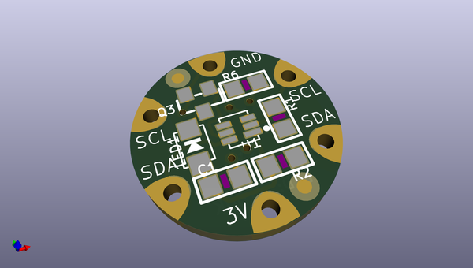
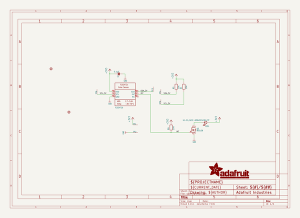
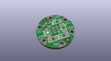
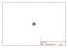
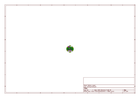
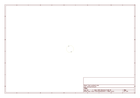
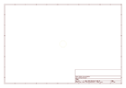
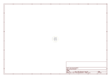

# OOMP Project  
## Adafruit-Flora-TCS34725-Color-Sensor-PCB  by adafruit  
  
oomp key: oomp_projects_flat_adafruit_adafruit_flora_tcs34725_color_sensor_pcb  
(snippet of original readme)  
  
-- Adafruit Flora TCS34725 Color Sensor PCB  
  
<a href="http://www.adafruit.com/products/1356">   
Click here to purchase one from the Adafruit shop</a>  
  
PCB files for the Adafruit Flora TCS34725 Color Sensor. Format is EagleCAD schematic and board layout  
* https://www.adafruit.com/product/1356  
  
--- Description  
  
Your electronics can now see in dazzling color with this lovely color light sensor. We found the best color sensor on the market, the TCS34725, which has RGB and Clear light sensing elements. An IR blocking filter, integrated on-chip and localized to the color sensing photodiodes, minimizes the IR spectral component of the incoming light and allows color measurements to be made accurately. The filter means you'll get much truer color than most sensors, since humans don't see IR. The sensor also has an incredible 3,800,000:1 dynamic range with adjustable integration time and gain so it is suited for use behind darkened glass or fabric.  
  
To make sure you get consistent color, we specified a nice neutral 4150°K temperature LED with a MOSFET driver onboard to illuminate what you're trying to sense. The LED can be easily turned on during sensing and turned off afterwards to save power.  
  
--- License  
  
Adafruit invests time and resources providing this open source design, please support Adafruit and open-source hardware by purchasing products from [Adafruit](https://www.adafruit.com)!  
  
Designed by Limor Fried/Ladyada for Adaf  
  full source readme at [readme_src.md](readme_src.md)  
  
source repo at: [https://github.com/adafruit/Adafruit-Flora-TCS34725-Color-Sensor-PCB](https://github.com/adafruit/Adafruit-Flora-TCS34725-Color-Sensor-PCB)  
## Board  
  
  
## Schematic  
  
  
  
[schematic pdf](working_schematic.pdf)  
## Images  
  
  
  
  
  
  
  
  
  
  
  
  
  
  
  
  
