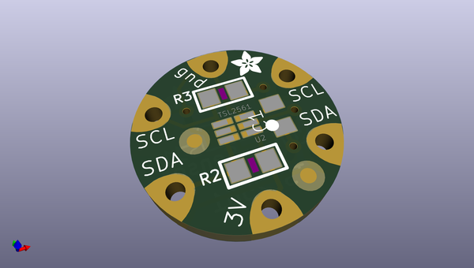
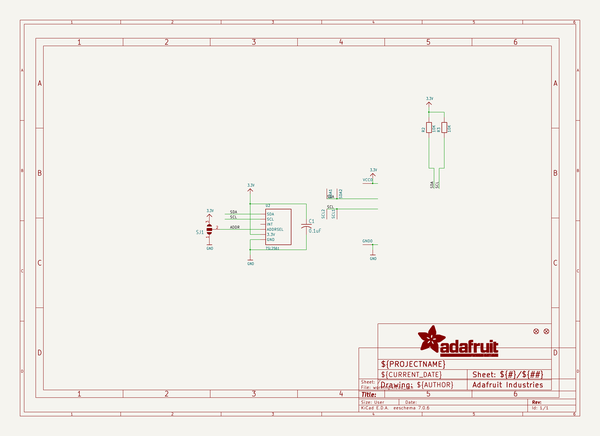
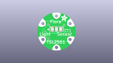
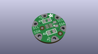
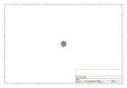
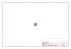
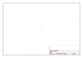
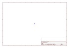
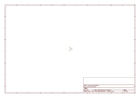

# OOMP Project  
## Adafruit-Flora-TSL2561-Lux-Sensor-PCB  by adafruit  
  
(snippet of original readme)  
  
-- Adafruit Flora TSL2561 Lux Sensor PCB  
  
<a href="http://www.adafruit.com/products/1246">   
Click here to purchase one from the Adafruit shop</a>  
  
PCB files for the Adafruit Flora TSL2561 Lux Sensor. Format is EagleCAD schematic and board layout  
* https://www.adafruit.com/product/1246  
  
--- DESCRIPTION  
Add light-reactive sensing to your wearable Flora project with this high precision Lux sensor. The TSL2561 luminosity sensor is an advanced digital light sensor, ideal for use in a wide range of light situations. Compared to low cost CdS cells, this sensor is more precise, allowing for exact lux calculations and can be configured for different gain/timing ranges to detect light ranges from up to 0.1 - 40,000+ Lux on the fly. The best part of this sensor is that it contains both infrared and full spectrum diodes! That means you can separately measure infrared, full-spectrum or human-visible light. Most sensors can only detect one or the other, which does not accurately represent what human eyes see (since we cannot perceive the IR light that is detected by most photo diodes)  
  
The sensor has a digital (I2C) interface. Attaching it to the flora is simple: line up the sensor so its adjacent to the SDA/SCL pins and sew conductive thread from the 3V, SDA, SCL and GND pins. They line up perfectly so you will not have any crossed lines. You can only connect one lux sensor to your Flora, but you can connect other I2C sensors/outputs   
  full source readme at [readme_src.md](readme_src.md)  
  
source repo at: [https://github.com/adafruit/Adafruit-Flora-TSL2561-Lux-Sensor-PCB](https://github.com/adafruit/Adafruit-Flora-TSL2561-Lux-Sensor-PCB)  
## Board  
  
  
## Schematic  
  
  
  
[schematic pdf](working_schematic.pdf)  
## Images  
  
  
  
  
  
  
  
  
  
  
  
  
  
  
  
  
