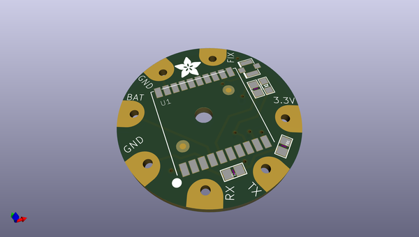
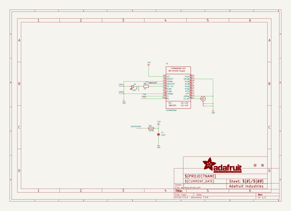
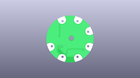
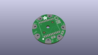
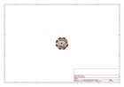
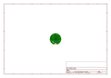
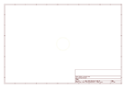
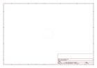
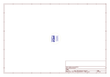
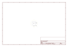

# OOMP Project  
## Adafruit-Flora-Ultimate-GPS  by adafruit  
  
oomp key: oomp_projects_flat_adafruit_adafruit_flora_ultimate_gps  
(snippet of original readme)  
  
- PCB for the Adafruit Flora Ultimate GPS  
  
<a href="http://www.adafruit.com/products/1059"> Click here to purchase one from the Adafruit shop</a>  
  
__Format is EagleCAD schematic and board layout__  
  
This module is the best way to add a GPS to your wearable project. It's part of the Adafruit Flora series of wearable electronics, designed specifically for use with the Flora motherboard. Installed on the PCB is the latest of our Ultimate GPS modules, a small, super-thin, low power GPS module with built in data-logging capability! This module's easy to use, but extremely powerful:  
  
- -165 dBm sensitivity, 10 Hz updates, 66 channels  
- Designed for wearable use with the Flora system  
- Only 20mA current draw  
- RTC battery-compatible - sew a battery on to create a atomic-precision real time clock  
- Built-in datalogging  
- Internal patch antenna + u.FL connector for external active antenna  
- Fix status LED  
  
...all for under $40!  
  
The breakout is built around the MTK3339 chipset, a no-nonsense, high-quality GPS module that can track up to 22 satellites on 66 channels, has an excellent high-sensitivity receiver (-165 dB tracking!), and a built in antenna. It can do up to 10 location updates a second for high speed, high sensitivity logging or tracking. Power usage is incredibly low, only 20 mA during navigation.  
  
The module is kept small and simple, we have a ferrite bead, filter capacitor and red fix LED on board. The LED blinks at a  
  full source readme at [readme_src.md](readme_src.md)  
  
source repo at: [https://github.com/adafruit/Adafruit-Flora-Ultimate-GPS](https://github.com/adafruit/Adafruit-Flora-Ultimate-GPS)  
## Board  
  
  
## Schematic  
  
  
  
[schematic pdf](working_schematic.pdf)  
## Images  
  
  
  
  
  
  
  
  
  
  
  
  
  
  
  
  
