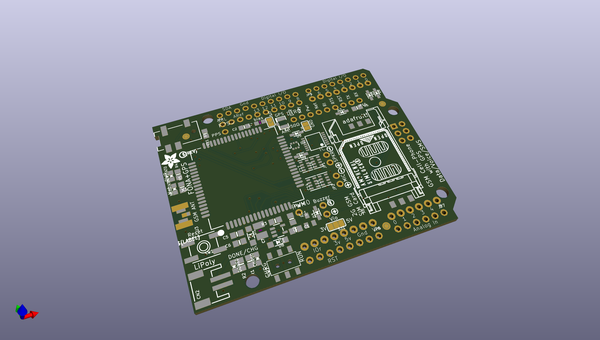
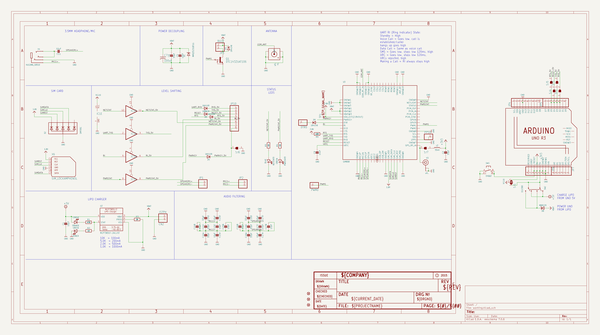
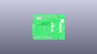
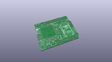
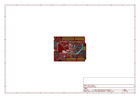
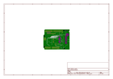
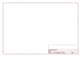
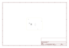
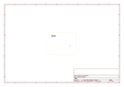
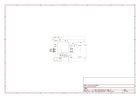

# OOMP Project  
## Adafruit-FONA808-Shield-PCB  by adafruit  
  
(snippet of original readme)  
  
-- Adafruit FONA808 Shield PCB  
  
<a href="http://www.adafruit.com/products/2636">   
Click here to purchase one from the Adafruit shop</a>  
  
PCB files for the Adafruit FONA808 Shield. Format is EagleCAD schematic and board layout  
* https://www.adafruit.com/products/2636  
  
--- DESCRIPTION  
Cellular + GPS tracking, all in one, for your Arduino? Oh yes! Introducing Adafruit FONA 808 GSM + GPS Shield, an all-in-one cellular phone module with that lets you add location-tracking, voice, text, SMS and data to your project, in Arduino shield format for easy use.  
  
If you want a version without GPS, check out the FONA 800 Shield [here](https://www.adafruit.com/product/2468).  
  
If you don't need the shield format, we also have this is a petite breakout [here](https://www.adafruit.com/product/2542).  
  
If you just want a plain FONA, [click here](https://www.adafruit.com/product/1946).  
  
This shield fits right over your Arduino or compatible. At the heart is a powerful GSM cellular module (we use the latest SIM808) with integrated GPS. This module can do just about everything  
  
- Quad-band 850/900/1800/1900MHz - connect onto any global GSM network with any 2G SIM (in the USA, T-Mobile is suggested)  
- Fully-integrated GPS (MT3337 chipset with -165 dBm tracking sensitivity) that can be controlled and query over the same serial port  
- Make and receive voice calls using a headset or an external 32Ω speaker + electret microphone  
- Send and receive SM  
  full source readme at [readme_src.md](readme_src.md)  
  
source repo at: [https://github.com/adafruit/Adafruit-FONA808-Shield-PCB](https://github.com/adafruit/Adafruit-FONA808-Shield-PCB)  
## Board  
  
  
## Schematic  
  
  
  
[schematic pdf](working_schematic.pdf)  
## Images  
  
  
  
  
  
  
  
  
  
  
  
  
  
  
  
  
