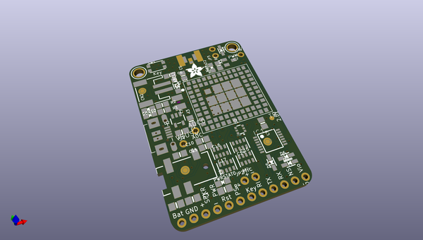
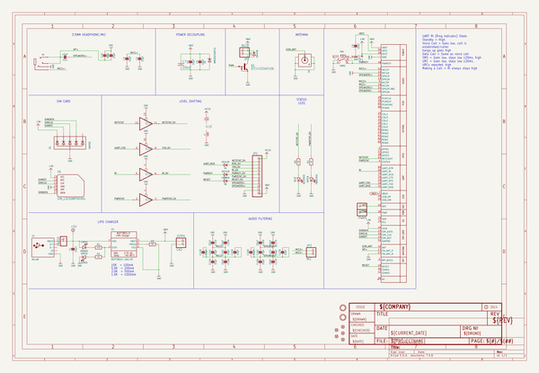
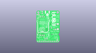
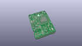
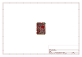
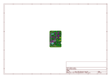
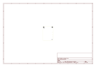
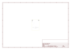
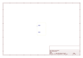
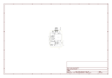

# OOMP Project  
## Adafruit-FONA-800-GSM-Breakout-PCB  by adafruit  
  
(snippet of original readme)  
  
- Adafruit FONA 800 GSM Breakout PCBs  
&nbsp;    
Click to purchase from the Adafruit Shop:  
- [Adafruit FONA - Mini Cellular GSM Breakout - SMA Version - v1](https://www.adafruit.com/product/1963)  
- [Adafruit FONA - Mini Cellular GSM Breakout uFL Version](https://www.adafruit.com/product/1946)  
  
This module measures only 1.75"x1.25" but packs a surprising amount of technology into its little frame. At the heart is a GSM cellular module (we use the latest SIM800) the size of a postage stamp. This module can do just about everything. One version has an SMA connector, the other has a uFL connector.  
  
Quad-band 850/900/1800/1900MHz - connect onto any global GSM network with any 2G SIM (in the USA, T-Mobile is suggested)  
- Make and receive voice calls using a headset OR an external 8Ω speaker + electret microphone  
- Send and receive SMS messages  
- Send and receive GPRS data (TCP/IP, HTTP, etc.)  
- Scan and receive FM radio broadcasts (yeah, we don't exactly know why this was included but it works really well)  
- PWM/Buzzer vibrational motor control  
- AT command interface with "auto baud" detection  
  
PCB files for the Adafruit FONA 800 GSM Cellular Breakouts. The format is EagleCAD schematic and board layout  
- https://www.adafruit.com/products/1963  
- https://www.adafruit.com/products/  
  full source readme at [readme_src.md](readme_src.md)  
  
source repo at: [https://github.com/adafruit/Adafruit-FONA-800-GSM-Breakout-PCB](https://github.com/adafruit/Adafruit-FONA-800-GSM-Breakout-PCB)  
## Board  
  
  
## Schematic  
  
  
  
[schematic pdf](working_schematic.pdf)  
## Images  
  
  
  
  
  
  
  
  
  
  
  
  
  
  
  
  
