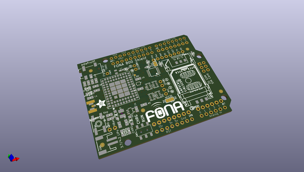
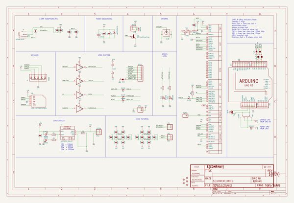
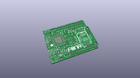
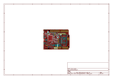
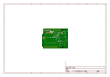
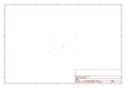
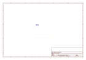
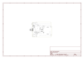

# OOMP Project  
## Adafruit-FONA-800-Shield-PCB  by adafruit  
  
oomp key: oomp_projects_flat_adafruit_adafruit_fona_800_shield_pcb  
(snippet of original readme)  
  
-- Adafruit FONA 800 Shield PCB  
  
<a href="http://www.adafruit.com/products/2468">   
Click here to purchase one from the Adafruit shop</a>  
  
PCB files for the Adafruit FONA 800 Shield. Format is EagleCAD schematic and board layout  
* https://www.adafruit.com/products/2468  
  
--- DESCRIPTION  
Ring, Ring! Who's that callin'? It's your microcontroller! Introducing Adafruit FONA 800 Shield, an adorable all-in-one cellular phone shield that lets you add voice, text, SMS and data to your project in an easy to use pluggable shield.  
  
This shield fits on top of any classic Arduino or compatible, and packs a surprising amount of technology into it's little frame. At the heart is a GSM cellular module (we use the latest SIM800) the size of a postage stamp. This module can do just about everything.   
  
If you want a Shield Version with GPS, check out the Adafruit FONA 808 Shield - Mini Cellular GSM + GPS for Arduino [click here](https://www.adafruit.com/product/2636).  
  
If you just want a plain FONA breakout, [click here](https://www.adafruit.com/product/1946).  
  
Quad-band 850/900/1800/1900MHz - connect onto any global GSM network with any 2G SIM (in the USA, T-Mobile is suggested)  
Make and receive voice calls using a headset OR an external 8Ω speaker + electret microphone  
Send and receive SMS messages  
Send and receive GPRS data (TCP/IP, HTTP, etc.)  
Scan and receive FM radio broadcasts (yeah, we don't exactly know why this was included but it w  
  full source readme at [readme_src.md](readme_src.md)  
  
source repo at: [https://github.com/adafruit/Adafruit-FONA-800-Shield-PCB](https://github.com/adafruit/Adafruit-FONA-800-Shield-PCB)  
## Board  
  
  
## Schematic  
  
  
  
[schematic pdf](working_schematic.pdf)  
## Images  
  
  
  
  
  
  
  
  
  
  
  
  
  
  
  
  
