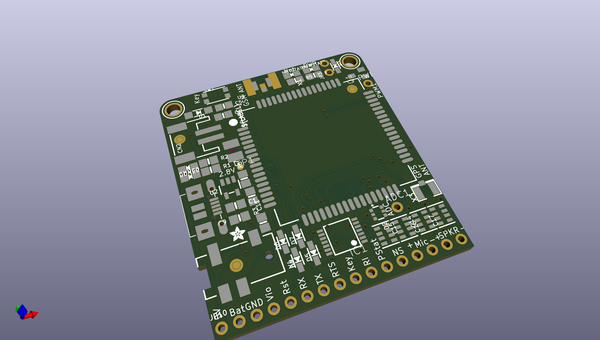
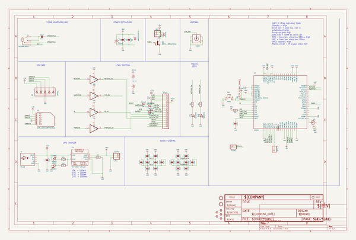
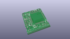
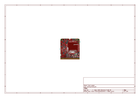
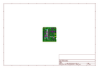
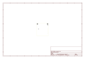
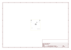
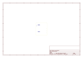
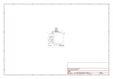

# OOMP Project  
## Adafruit-FONA-808-Breakout-PCB  by adafruit  
  
(snippet of original readme)  
  
-- Adafruit FONA 808 Breakout PCB  
<a href="http://www.adafruit.com/products/2542">   
Click here to purchase one from the Adafruit shop</a>  
  
Cellular + GPS tracking, all in one? Oh yes! Introducing Adafruit FONA 808 MiniGSM + GPS, an all-in-one cellular phone module with that lets you add location-tracking, voice, text, SMS and data to your project in an adorable little package. (It does not contain a drum machine, tho)  
  
This module measures only 1.75"x1.6" but packs a surprising amount of technology into it's little frame. At the heart is a powerful GSM cellular module (we use the latest SIM808) with integrated GPS. This module can do just about everything.  
  
PCB files for the Adafruit FONA 808 Breakout. The format is EagleCAD schematic and board layout  
 https://www.adafruit.com/products/2542   
  
--- License  
  
Adafruit invests time and resources providing this open source design, please support Adafruit and open-source hardware by purchasing products from [Adafruit](https://www.adafruit.com)!  
  
All text above must be included in any redistribution  
  
Designed by Limor Fried/Ladyada for Adafruit Industries.  
Creative Commons Attribution/Share-Alike, all text above must be included in any redistribution.   
See license.txt for additional information.  
  
  full source readme at [readme_src.md](readme_src.md)  
  
source repo at: [https://github.com/adafruit/Adafruit-FONA-808-Breakout-PCB](https://github.com/adafruit/Adafruit-FONA-808-Breakout-PCB)  
## Board  
  
  
## Schematic  
  
  
  
[schematic pdf](working_schematic.pdf)  
## Images  
  
  
  
  
  
  
  
  
  
  
  
  
  
  
  
  
