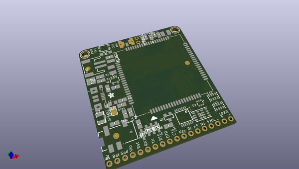
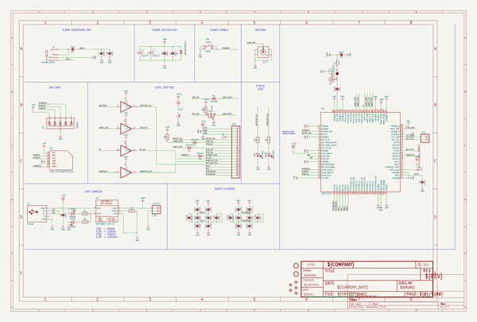
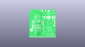
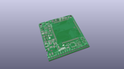
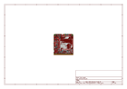
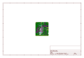
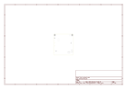
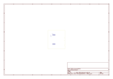
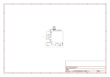

# OOMP Project  
## Adafruit-FONA-SIMCOM-3G-Breakout-PCB  by adafruit  
  
oomp key: oomp_projects_flat_adafruit_adafruit_fona_simcom_3g_breakout_pcb  
(snippet of original readme)  
  
-- Adafruit FONA SIMCOM 3G Breakouts PCB  
<a href="http://www.adafruit.com/products/3147">   
Click here to purchase one from the Adafruit shop</a>  
  
For those who want to take it to the next level we now have a 3G Cellular Modem breakout! The FONA 3G has better coverage, GSM backwards-compatibility and even sports a built-in GPS module for geolocation & asset tracking. This all-in-one cellular phone module with that lets you add location-tracking, voice, text, SMS and data to your project in a single breakout.  
  
This module measure only 1.75"x1.6" but packs a surprising amount of technology into it's little frame. At the heart is a powerfull GSM cellular module (we use the latest SIM5320A) with integrated GPS.  
  
For more details, see the various versions available:  
  
  * https://www.adafruit.com/products/3147  
  * https://www.adafruit.com/products/2687  
  * https://www.adafruit.com/products/2691  
  * https://www.adafruit.com/products/2696  
    
PCB files for the Adafruit FONA SIMCOM 3G Breakout. The format is EagleCAD schematic and board layout  
  
--- License  
  
Adafruit invests time and resources providing this open source design, please support Adafruit and open-source hardware by purchasing products from [Adafruit](https://www.adafruit.com)!  
  
All text above must be included in any redistribution  
  
Designed by Limor Fried/Ladyada for Adafruit Industries.  
Creative Commons Attribution/Share-Alike, all text above must be included in any re  
  full source readme at [readme_src.md](readme_src.md)  
  
source repo at: [https://github.com/adafruit/Adafruit-FONA-SIMCOM-3G-Breakout-PCB](https://github.com/adafruit/Adafruit-FONA-SIMCOM-3G-Breakout-PCB)  
## Board  
  
  
## Schematic  
  
  
  
[schematic pdf](working_schematic.pdf)  
## Images  
  
  
  
  
  
  
  
  
  
  
  
  
  
  
  
  
