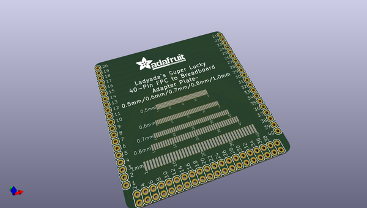
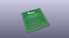
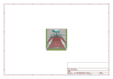
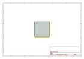
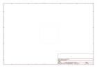
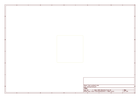
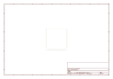

# OOMP Project  
## Adafruit-FPC-SMT-Adapter-PCBs  by adafruit  
  
oomp key: oomp_projects_flat_adafruit_adafruit_fpc_smt_adapter_pcbs  
(snippet of original readme)  
  
-- Adafruit FPC SMT Adapter PCBs  
&nbsp;   
&nbsp;   
   
Click to purchase from the Adafruit Shop:  
- [Adafruit FPC Stick - 20 Pin 0.5mm/1.0mm Pitch Adapter](https://www.adafruit.com/product/1325)  
- [Adafruit Multi-pitch FPC Adapter - 40 Pin 0.5/0.6/0.7/0.8/1.0mm](https://www.adafruit.com/product/1436)  
- [Adafruit 50 pin 0.5mm pitch FPC Adapter](https://www.adafruit.com/product/1492)  
  
Connect to 0.5mm, 1.0mm and even some 2.0mm pitch connectors that you may run across with an FPC stick. We designed this for use in house, to quickly connect to FPCs we need to test. But we also thought it might be useful for our customers. On either side is a 20 pin 0.5 or 1.0mm pitch connector with long pads and one very long 'mechanical' pad. Each pad is broken out to a 20-pin long 0.1" spaced header. It can accommodate most ZIF and snap connectors and will make prototyping much easier on you!  
  
You will roll lucky 7's and connect to nearly any kind of FPC/flex cable with Ladyada's Super Lucky 40-pin FPC to breadboard adapter plate. You get 40 pads of 0.5mm, 0.6mm, 0.7mm, 0.8mm or 1.0mm. It may even work for some 2.0mm pitch connectors. We designed this for use in house, to quickly connect to FP  
  full source readme at [readme_src.md](readme_src.md)  
  
source repo at: [https://github.com/adafruit/Adafruit-FPC-SMT-Adapter-PCBs](https://github.com/adafruit/Adafruit-FPC-SMT-Adapter-PCBs)  
## Board  
  
  
## Schematic  
  
  
  
[schematic pdf](working_schematic.pdf)  
## Images  
  
  
  
  
  
  
  
  
  
  
  
  
  
  
  
  
