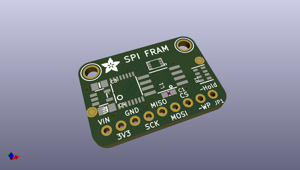
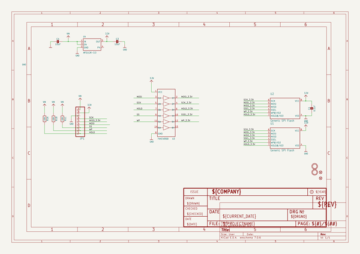
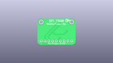
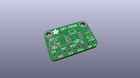
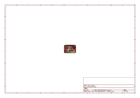
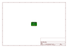
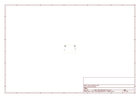
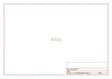

# OOMP Project  
## Adafruit-FRAM-Breakout-PCB  by adafruit  
  
oomp key: oomp_projects_flat_adafruit_adafruit_fram_breakout_pcb  
(snippet of original readme)  
  
- Adafruit FRAM Breakout PCBs  
  
&nbsp;    
Click to purchase from the Adafruit Shop:  
- [I2C Version](https://www.adafruit.com/product/1895)  
- [SPI Version](https://www.adafruit.com/product/1897)  
- [2 Mbit SPI Version](https://www.adafruit.com/product/4718)  
- [4 Mbit SPI Version](https://www.adafruit.com/product/4719)  
  
  
FRAM, or Ferroelectric Ram, is pretty cool! It's similar to Dynamic random-access memory, only with a ferroelectric layer instead of a dielectric layer. This gives it stable handling (the bytes you write are non-volatile) with dynamic responsiveness (you can write them very fast!)  
  
Now, with our FRAM breakout boards, you can add some FRAM storage to your next DIY project. FRAM allows for a lower power usage and a faster write performance. It's excellent for low-power or inconsistent-power datalogging or data buffering where you want to stream data fast while also keeping the data when there's no power. Unlike Flash or EEPROM there's no pages to worry about. Each byte can be read/written 10,000,000,000,000 times so you don't have to worry too much about wear leveling.  
  
These particular FRAM chips have 64 Kbits (8 KBytes) of storage, interfaces using SPI or I2C (select the correct board for the correct bus, they cannot do both!), and can run at up to 20MHz SPI   
  full source readme at [readme_src.md](readme_src.md)  
  
source repo at: [https://github.com/adafruit/Adafruit-FRAM-Breakout-PCB](https://github.com/adafruit/Adafruit-FRAM-Breakout-PCB)  
## Board  
  
  
## Schematic  
  
  
  
[schematic pdf](working_schematic.pdf)  
## Images  
  
  
  
  
  
  
  
  
  
  
  
  
  
  
  
  
