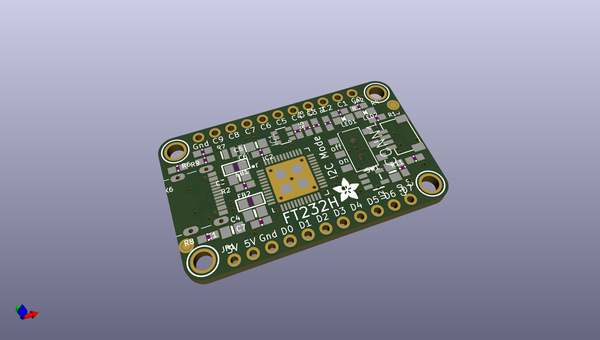
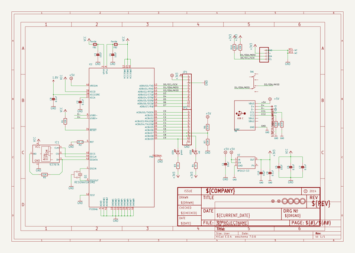
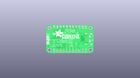
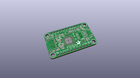
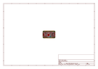
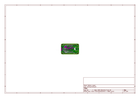
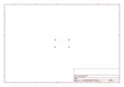
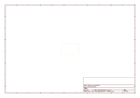
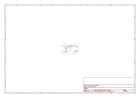

# OOMP Project  
## Adafruit-FT232H-Breakout-PCB  by adafruit  
  
oomp key: oomp_projects_flat_adafruit_adafruit_ft232h_breakout_pcb  
(snippet of original readme)  
  
-- Adafruit FT232H Breakout PCB  
<a href="http://www.adafruit.com/products/2264">   
Click here to purchase one from the Adafruit shop</a>  
  
Wouldn't it be cool to drive a tiny OLED display, read a color sensor, or even just flash some LEDs directly from your computer?  Sure you can program an Arduino or Trinket to talk to these devices and your computer, but why can't your computer just talk to those devices and sensors itself?  Well, now your computer can talk to devices using the Adafruit FT232H breakout board!  
  
What can the FT232H chip do?  This chip from FTDI is similar to their USB to serial converter chips but adds a 'multi-protocol synchronous serial engine' which allows it to speak many common protocols like SPI, I2C, serial UART, JTAG, and more!  There's even a handful of digital GPIO pins that you can read and write to do things like flash LEDs, read switches or buttons, and more.  The FT232H breakout is like adding a little swiss army knife for serial protocols to your computer!  
  
PCB files for the Adafruit FT232H Breakout. The format is EagleCAD schematic and board layout  
- http://www.adafruit.com/products/2264  
  
--- License  
  
Adafruit invests time and resources providing this open source design, please support Adafruit and open-source hardware by purchasing products from [Adafruit](https://www.adafruit.com)!  
  
All text above must be included in any redistribution  
  
Designed by Limor Fried/Ladyada for Adafruit Industr  
  full source readme at [readme_src.md](readme_src.md)  
  
source repo at: [https://github.com/adafruit/Adafruit-FT232H-Breakout-PCB](https://github.com/adafruit/Adafruit-FT232H-Breakout-PCB)  
## Board  
  
  
## Schematic  
  
  
  
[schematic pdf](working_schematic.pdf)  
## Images  
  
  
  
  
  
  
  
  
  
  
  
  
  
  
  
  
