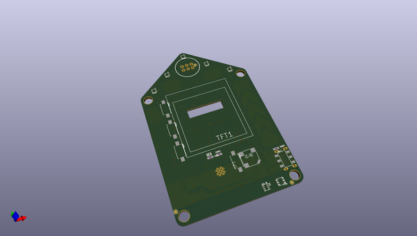
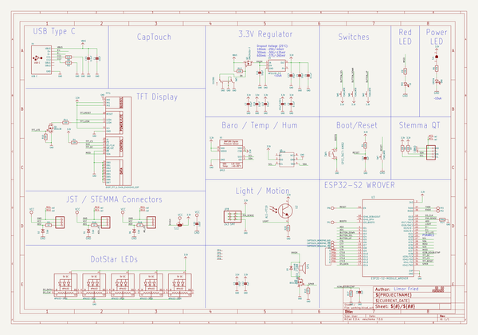
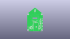
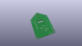
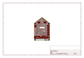
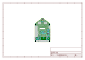
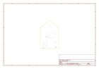
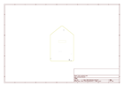
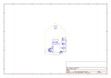
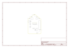

# OOMP Project  
## Adafruit-FunHouse-PCB  by adafruit  
  
(snippet of original readme)  
  
-- Adafruit FunHouse PCB  
  
<a href="http://www.adafruit.com/products/4985">   
Click here to purchase one from the Adafruit shop</a>  
  
PCB files for the Adafruit FunHouse.   
  
Format is EagleCAD schematic and board layout  
* https://www.adafruit.com/product/4985  
  
--- Description  
  
Home is where the heart is...it's also where we keep all our electronic bits. So why not wire it up with sensors and actuators to turn our house into an electronic wonderland. Whether it's tracking the environmental temperature and humidity in your laundry room, or notifying you when someone is detected in the kitchen, to sensing when a window was left open, or logging when your cat leaves through the pet door, this board is designed to make it way easy to make WiFi-connected home automation projects.  
  
The main processor is the ESP32-S2, which has the advantage of the low cost and power of the ESP32 with the flexibility of CircuitPython support thanks to native USB support. There's also Arduino support for this chip, and many existing ESP32 projects seem to run as-is. Note this chip does not have BLE support, but for WiFi projects its great. You can use it to connect to IoT services or just the Internet in general, with SSL support and this module has plenty of PSRAM for any kind of data processing.  
  
The board is designed to make it easy to wire up sensors with little or no soldering. There are built in sensors for light, pressure, humidity and temperatu  
  full source readme at [readme_src.md](readme_src.md)  
  
source repo at: [https://github.com/adafruit/Adafruit-FunHouse-PCB](https://github.com/adafruit/Adafruit-FunHouse-PCB)  
## Board  
  
  
## Schematic  
  
  
  
[schematic pdf](working_schematic.pdf)  
## Images  
  
  
  
  
  
  
  
  
  
  
  
  
  
  
  
  
