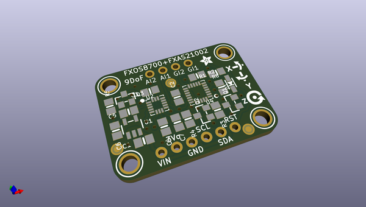
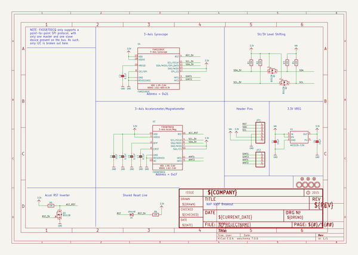
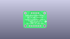
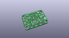
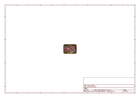
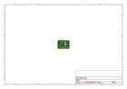
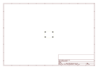
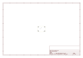
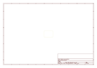
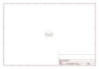

# OOMP Project  
## Adafruit-FXOS8700-FXAS21002-9-DoF-Breakout-PCB  by adafruit  
  
(snippet of original readme)  
  
-- Adafruit FXOS8700 FXAS21002 9-DoF Breakout PCB  
  
<a href="http://www.adafruit.com/products/3463">   
Click here to purchase one from the Adafruit shop</a>  
  
PCB files for the Adafruit FXOS8700 + FXAS21002 9 DoF Breakout. Format is EagleCAD schematic and board layout  
  
For more details, check out the product page at  
* https://www.adafruit.com/products/3463  
  
--- Description  
  
The NXP Precision 9DoF breakout combines two of the best motion sensors we've tested here at Adafruit: The FXOS8700 3-Axis accelerometer and magnetometer, and the FXAS21002 3-axis gyroscope.  
  
These two sensors combine to make a nice 9-DoF kit, that can be used for motion and orientation sensing. In particular, we think this sensor set is ideal for AHRS-based orientation calculations: the gyro stability performance is superior to the LSM9DS0, LSM9DS1, L3GD20H + LSM303, MPU-9250, and even the BNO-055 (see our Gyro comparison tutorial for more details).  
  
Compared to the BNO055, this sensor will get you similar orientation performance but at a lower price because the calculations are done on your microcontroller, not in the sensor itself. The trade off is you will sacrifice about 15KB of Flash space, and computing cycles, to do the math 'in house.'  
  
To make it fast and easy for you to get started, we have a version of AHRS that we've adapted to work over USB or Bluetooth LE. Load the code onto your Arduino-compatible board and you will get orientation data in  
  full source readme at [readme_src.md](readme_src.md)  
  
source repo at: [https://github.com/adafruit/Adafruit-FXOS8700-FXAS21002-9-DoF-Breakout-PCB](https://github.com/adafruit/Adafruit-FXOS8700-FXAS21002-9-DoF-Breakout-PCB)  
## Board  
  
  
## Schematic  
  
  
  
[schematic pdf](working_schematic.pdf)  
## Images  
  
  
  
  
  
  
  
  
  
  
  
  
  
  
  
  
