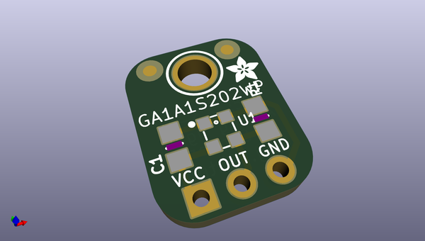
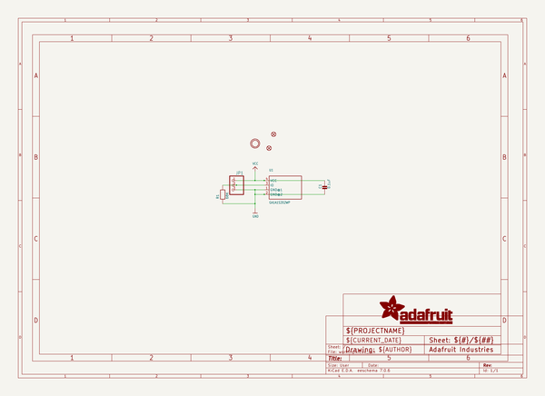
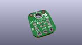
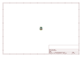
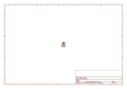
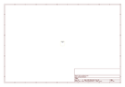
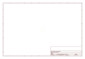
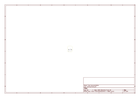

# OOMP Project  
## Adafruit-GA1A1S202WP-Breakout-PCB  by adafruit  
  
(snippet of original readme)  
  
-- Adafruit GA1A1S202WP Breakout PCB  
  
<a href="http://www.adafruit.com/products/1384">   
Click here to purchase one from the Adafruit shop</a>  
  
PCB files for the Adafruit GA1A1S202WP Light Sensor. Format is EagleCAD schematic and board layout  
* https://www.adafruit.com/products/1384  
  
--- DESCRIPTION  
Upgrade a project that uses a photocell with the GA1A12S202 analog light sensor. Like a CdS photo-cell, the sensor does not require a microcontroller, the analog voltage output increases with the amount of light shining on the sensor face. This sensor has a lot of improvements that make it better for nearly any project.  
  
The biggest improvement over plain photocells is a true log-lin relationship with light levels. Most light sensors have a linear relationship with light levels, which means that they're not very sensitive to changes in darkened areas and 'max' out very easily when there's a lot of light. Sometimes you can tweak a resistor to make them better in dark or bright light but its hard to get good performance at both ends. This sensor is logarithmic over a large dynamic range of 3 to 55,000 Lux, so it has a lot of sensitivity at low light levels but is also nearly impossible to "max out" so you can use it indoors or outdoors without changing code or calibration. Since the sensor is fabricated on a chip, there are also fewer manufacturing variations, so you won't have to calibrate the sensor from one board to another.  
  
  
  full source readme at [readme_src.md](readme_src.md)  
  
source repo at: [https://github.com/adafruit/Adafruit-GA1A1S202WP-Breakout-PCB](https://github.com/adafruit/Adafruit-GA1A1S202WP-Breakout-PCB)  
## Board  
  
  
## Schematic  
  
  
  
[schematic pdf](working_schematic.pdf)  
## Images  
  
  
  
  
  
  
  
  
  
  
  
  
  
  
  
  
