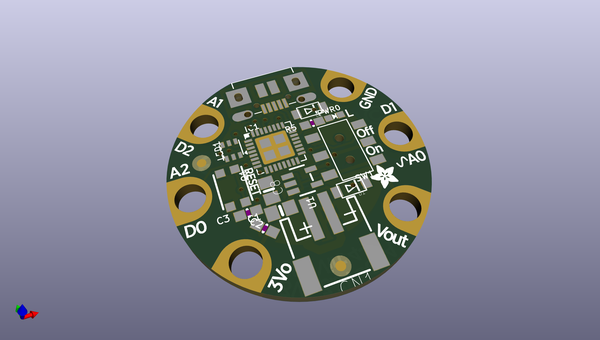
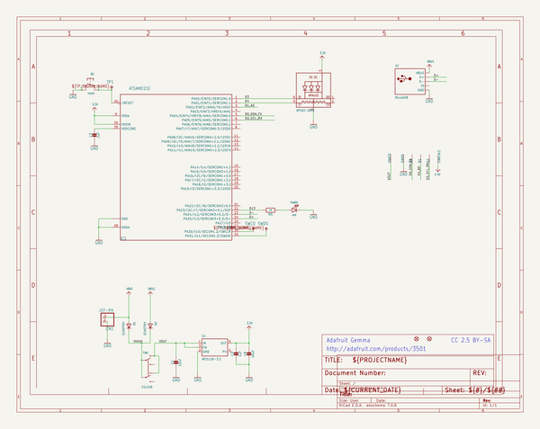
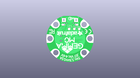
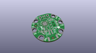
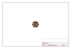
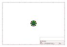
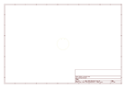
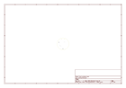
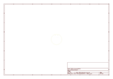
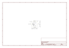

# OOMP Project  
## Adafruit-Gemma-M0-PCB  by adafruit  
  
(snippet of original readme)  
  
-- Adafruit Gemma M0 PCB  
  
<a href="http://www.adafruit.com/products/3501">   
Click here to purchase one from the Adafruit shop</a>  
  
PCB files for the Adafruit Gemma M0.   
  
This is the CAD & PCB data for the Adafruit Gemma. PCB format is EagleCAD schematic and board layout  
  
For more details, check out the product page at  
* https://www.adafruit.com/products/3501  
  
--- Description  
  
The Adafruit Gemma M0 is a super small microcontroller board, with just enough built-in to create many simple projects. It may look small and cute: round, about the size of a quarter, with friendly alligator-clip sew pads. But do not be fooled! The Gemma M0 is incredibly powerful! We've taken the same form factor we used for the original ATtiny85-based Gemma and gave it an upgrade. The Gemma M0 has swapped out the lightweight ATtiny85 for a ATSAMD21E18 powerhouse.  
  
The Gemma M0 will super-charge your wearables! It's just as small, and it's easier to use, so you can do more.  
  
The most exciting part of the Gemma M0 is that while you can use it with the Arduino IDE, we are shipping it with CircuitPython on board. When you plug it in, it will show up as a very small disk drive with main.py on it. Edit main.py with your favorite text editor to build your project using Python, the most popular programming language. No installs, IDE or compiler needed, so you can use it on any computer, even ChromeBooks or computers you can't install software on. When you'r  
  full source readme at [readme_src.md](readme_src.md)  
  
source repo at: [https://github.com/adafruit/Adafruit-Gemma-M0-PCB](https://github.com/adafruit/Adafruit-Gemma-M0-PCB)  
## Board  
  
  
## Schematic  
  
  
  
[schematic pdf](working_schematic.pdf)  
## Images  
  
  
  
  
  
  
  
  
  
  
  
  
  
  
  
  
