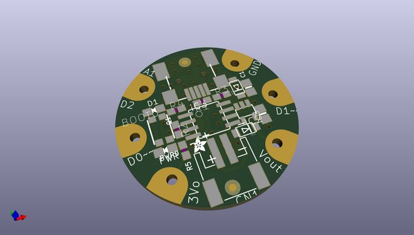
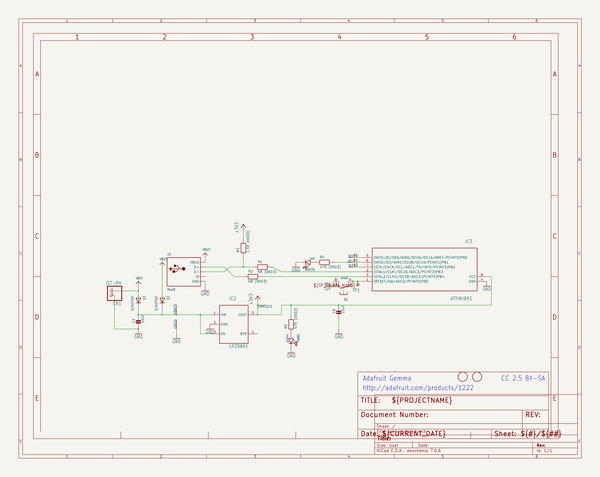
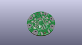
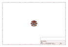
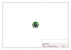
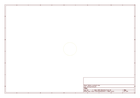
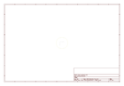
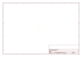
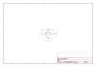

# OOMP Project  
## Adafruit-Gemma-PCB  by adafruit  
  
oomp key: oomp_projects_flat_adafruit_adafruit_gemma_pcb  
(snippet of original readme)  
  
-- Adafruit Gemma Classic (ATtiny85) PCB  
<a href="http://www.adafruit.com/products/1222">   
Click here to purchase one from the Adafruit shop</a>  
  
Deprecation Warning: The Gemma bit-bang USB technique it uses doesn't work as well as it did in 2014, many modern computers won't work well. So while we still carry the Gemma so that people can maintain some older projects, we no longer recommend it. Please check out the Gemma M0. It has built-in USB, more capabilities, and is comparable in price!  
  
GEMMA is a tiny wearable platform board with a lot of might in a 1" diameter package. Powered by a Attiny85 and programmable with an Arduino IDE over USB, you'll be able to realize any wearable project!  
  
We wanted to design a microcontroller board that was small enough to fit into any project, and low cost enough to use without hesitation. Perfect for when you don't want to give up your Flora and you aren't willing to take apart the project you worked so hard to design. It's our lowest-cost sewable controller!  
  
The Attiny85 is a fun processor because despite being so small, it has 8K of flash, and 5 I/O pins, including analog inputs and PWM 'analog' outputs. We designed a USB bootloader so you can plug it into any computer and reprogram it over a USB port just like an Arduino (it uses 2 of the 5 I/O pins, leaving you with 3). In fact we even made some simple modifications to the Arduino IDE so that it works like a mini-Flora. Perfect   
  full source readme at [readme_src.md](readme_src.md)  
  
source repo at: [https://github.com/adafruit/Adafruit-Gemma-PCB](https://github.com/adafruit/Adafruit-Gemma-PCB)  
## Board  
  
  
## Schematic  
  
  
  
[schematic pdf](working_schematic.pdf)  
## Images  
  
  
  
  
  
  
  
  
  
  
  
  
  
  
  
  
