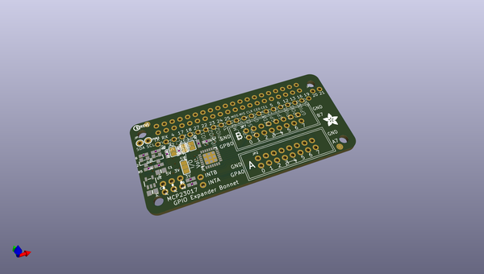
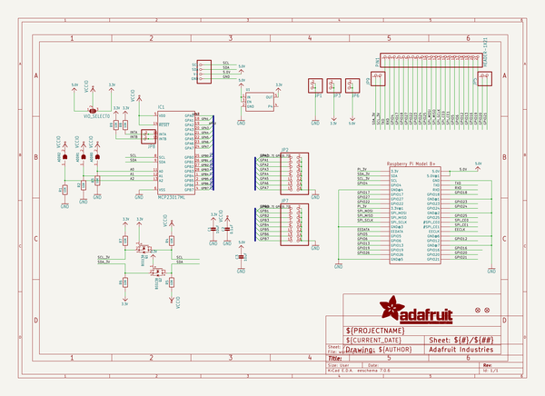
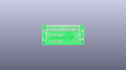
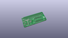
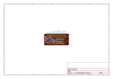
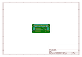
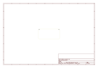
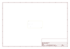
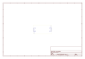
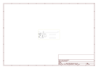

# OOMP Project  
## Adafruit-GPIO-Expander-Bonnet-PCBs  by adafruit  
  
(snippet of original readme)  
  
-- Adafruit GPIO Expander Bonnet PCB  
  
<a href="http://www.adafruit.com/products/4132">   
Click here to purchase one from the Adafruit shop</a>  
  
PCB files for the Adafruit GPIO Expander Bonnet. Format is EagleCAD schematic and board layout  
* https://www.adafruit.com/product/4132  
  
--- Description  
  
The Raspberry Pi is an amazing single board computer - and one of the best parts is that GPIO connector! 40 pins of digital goodness you can twiddle to control LEDs, sensors, buttons, radios, displays - just about any device you can imagine. This Adafruit GPIO Expander Bonnet will give you even more digital deliciousness - 16 more digital input/output pins are yours for any desire you have. The outputs are grouped into two 16-pin connectors that have a matching ground pin. You can set each pin to be a digital output (high or low) or as an input, with an internal pull-up if you like!  
  
Simply pop the Bonnet on top of your Pi, the circuitry connects to the SDA/SCL I2C pins for control. The MCP23017 chip converts our Python commands to pin instructions.  
  
When used as an output, each pin can supply up to 20mA (current clamped) - so you can drive LEDs directly. The datasheet recommends you keep the total current draw to under 125mA for the whole chip. We set up the expander chip for 5V logic by default (the I2C is level shifted so that's 3V logic). We did that so you can drive white, blue or green LEDs that sometimes aren't too happy with  
  full source readme at [readme_src.md](readme_src.md)  
  
source repo at: [https://github.com/adafruit/Adafruit-GPIO-Expander-Bonnet-PCBs](https://github.com/adafruit/Adafruit-GPIO-Expander-Bonnet-PCBs)  
## Board  
  
  
## Schematic  
  
  
  
[schematic pdf](working_schematic.pdf)  
## Images  
  
  
  
  
  
  
  
  
  
  
  
  
  
  
  
  
