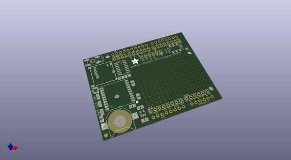
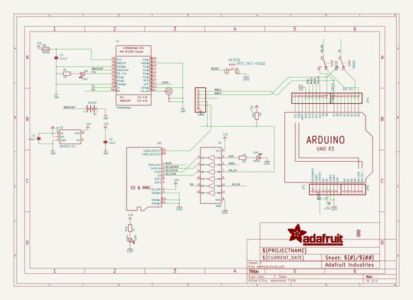
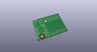
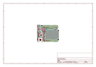
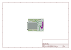
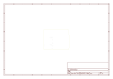
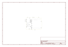

# OOMP Project  
## Adafruit-GPS-Logger-Shield-PCB  by adafruit  
  
oomp key: oomp_projects_flat_adafruit_adafruit_gps_logger_shield_pcb  
(snippet of original readme)  
  
-- Adafruit GPS Logger Shield PCB  
<a href="http://www.adafruit.com/products/1272">   
Click here to purchase one from the Adafruit shop</a>  
  
Better than ever, our Adafruit assembled GPS shield comes with an Ultimate GPS module. This GPS shield works great with either Adafruit Metro, Arduino UNO or Leonardo and is designed to log data to an SD card. Or you can leave the SD card out and use the GPS for a geocaching project, or maybe a music player that changes tunes depending on where you are in the city.  
   
- -165 dBm sensitivity, 10 Hz updates, 66 channels  
- Low power module - only 20mA current draw, half of most GPS's  
- Assembled & tested shield for Arduino Uno/Duemilanove/Diecimila/Leonardo (not for use with Mega/ADK/Due)  
- MicroSD card slot for datalogging onto a removable card  
- RTC battery included, for up to 7 years backup  
- Built-in datalogging to flash  
- PPS output on fix  
- Internal patch antenna + u.FL connector for external active antenna  
- Power, Pin -13 and Fix status LED  
- Big prototyping area  
  
PCB files for Adafruit GPS Logger Shield. The format is EagleCAD schematic and board layout  
- https://www.adafruit.com/products/1272  
  
--- License  
  
Adafruit invests time and resources providing this open source design, please support Adafruit and open-source hardware by purchasing products from [Adafruit](https://www.adafruit.com)!  
  
All text above must be included in any redistribution  
  
Designed by Limor Fried/Ladyada for   
  full source readme at [readme_src.md](readme_src.md)  
  
source repo at: [https://github.com/adafruit/Adafruit-GPS-Logger-Shield-PCB](https://github.com/adafruit/Adafruit-GPS-Logger-Shield-PCB)  
## Board  
  
  
## Schematic  
  
  
  
[schematic pdf](working_schematic.pdf)  
## Images  
  
  
  
  
  
  
  
  
  
  
  
  
  
  
  
  
