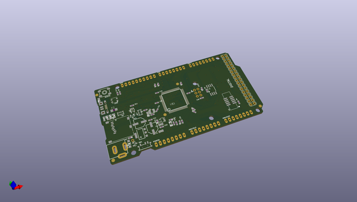

# OOMP Project  
## Adafruit-Grand-Central-PCB  by adafruit  
  
oomp key: oomp_projects_flat_adafruit_adafruit_grand_central_pcb  
(snippet of original readme)  
  
-- Adafruit Grand Central M4 Express featuring the SAMD51 PCB  
  
<a href="http://www.adafruit.com/products/4064">   
Click here to purchase one from the Adafruit shop</a>  
  
PCB files for the Adafruit Grand Central M4 Express featuring the SAMD51. Format is EagleCAD schematic and board layout  
* https://www.adafruit.com/product/4064  
  
--- Description  
  
We're selling out fast but making more all the time! Sign up to be notified when it's in the store!  
  
Are you ready? Really ready? Cause here comes the **Adafruit Grand Central** featuring the **Microchip ATSAMD51**. This dev board is so big, it's not named after a Metro train, it's a whole freakin' station!  
  
This board is like a freight train, with its 120MHz Cortex M4 with floating point support. Your code will zig and zag and zoom, and with a bunch of extra peripherals for support, this will for sure be your favorite new chipset.  
  
The Grand Central is the first SAMD board that has enough pins to make it in the form of the Arduino Mega - with a massive number of pins, tons of analog inputs, dual DAC output, 8 MBytes of QSPI flash, SD card socket, and a NeoPixel.  
  
To start off our ATSAMD51 journey we are going large with the Mega shape and pinout you know and love. The front half has the same shape and pinout as our Metro's, so it is compatible with all our shields. It's got analog pins where you expect, and SPI/UART/I2C hardware support in the same spot as the Metro 328 and M0. But!  
  full source readme at [readme_src.md](readme_src.md)  
  
source repo at: [https://github.com/adafruit/Adafruit-Grand-Central-PCB](https://github.com/adafruit/Adafruit-Grand-Central-PCB)  
## Board  
  
  
## Schematic  
  
  
  
[schematic pdf](working_schematic.pdf)  
## Images  
