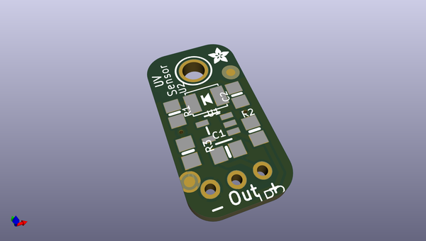
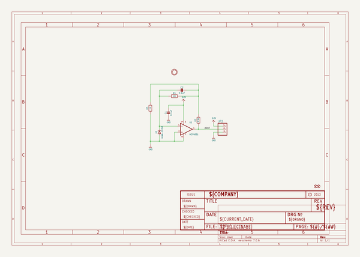
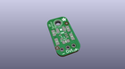
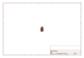
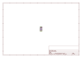
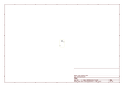
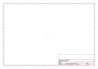
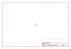

# OOMP Project  
## Adafruit-GUVA-Analog-UV-Sensor-Breakout-PCB  by adafruit  
  
oomp key: oomp_projects_flat_adafruit_adafruit_guva_analog_uv_sensor_breakout_pcb  
(snippet of original readme)  
  
- Adafruit-GUVA-Analog-UV-Sensor-Breakout-PCB  
  
__Format is EagleCAD schematic and board layout__  
  
<a href="http://www.adafruit.com/products/1918"> Click here to purchase one from the Adafruit shop</a>  
  
Extend your light-sensing spectrum with this analog UV sensor module. It uses a UV photodiode, which can detect the 240-370nm range of light (which covers UVB and most of UVA spectrum). The signal level from the photodiode is very small, in the nano-ampere level, so we tossed on an opamp to amplify the signal to a more manageable volt-level.  
  
This sensor is much simpler than our Si1145 breakout, it only does one thing and gives an analog voltage output instead of requiring a complicated I2C setup procedure. This makes it better for simple projects. It also has a 'true' UV sensor instead of a calibrated light-sensor. To use, power the sensor and op-amp by connecting V+ to 2.7-5.5VDC and GND to power ground. Then read the analog signal from the OUT pin. The output voltage is: Vo = 4.3 * Diode-Current-in-uA. So if the photocurrent is 1uA (9 mW/cm^2), the output voltage is 4.3V. You can also convert the voltage to UV Index by dividing the output voltage by 0.1V. So if the output voltage is 0.5V, the UV Index is about 5.  
  
Please note, our UV LEDs are 400nm, outside the range of this sensor, so if you're trying to test this sensor, don't use them! A UV tanning lamp or 'lizard-lamp' will work much better.  
  
-- License  
  
Adafruit inv  
  full source readme at [readme_src.md](readme_src.md)  
  
source repo at: [https://github.com/adafruit/Adafruit-GUVA-Analog-UV-Sensor-Breakout-PCB](https://github.com/adafruit/Adafruit-GUVA-Analog-UV-Sensor-Breakout-PCB)  
## Board  
  
  
## Schematic  
  
  
  
[schematic pdf](working_schematic.pdf)  
## Images  
  
  
  
  
  
  
  
  
  
  
  
  
  
  
  
  
