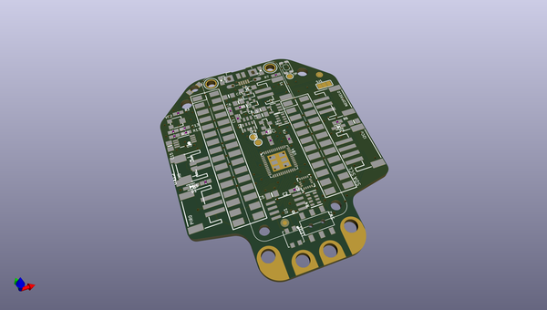
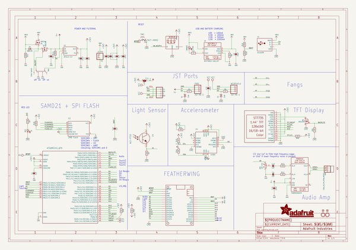
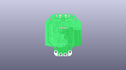
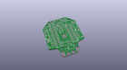
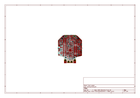
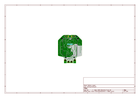
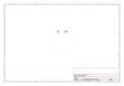
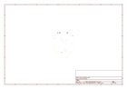
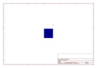
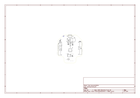

# OOMP Project  
## Adafruit-Hallowing-M0-PCB  by adafruit  
  
oomp key: oomp_projects_flat_adafruit_adafruit_hallowing_m0_pcb  
(snippet of original readme)  
  
-- Adafruit HalloWing M0 Express PCB  
  
<a href="http://www.adafruit.com/products/3900">   
Click here to purchase one from the Adafruit shop</a>  
  
PCB files for the Adafruit HalloWing M0 Express. Format is EagleCAD schematic and board layout  
* https://www.adafruit.com/product/3900  
  
--- Description  
[This is Hallowing..this is Hallowing... Hallowing! Hallowing!](https://www.youtube.com/watch?v=kGiYxCUAhks&t=39s)  
Are you the kind of person who doesn't like taking down the skeletons and spiders until after January? Well, we've got the development board for you. This is electronics at its most spooky! The **Adafruit HalloWing** is a skull-shaped ATSAMD21 board with a ton of extras built in to make for an adorable wearable, badge, development kit, or the engine for your next cosplay or prop.  
  
On the front is a cute **1.44" sized 128x128** full color TFT. Our default example code has our spooky eye demo running but you can use it for anything you like to display in glorious color.  
  
There's also 4 fang-teeth below the display, these are analog/capacitive touch inputs with big alligator-clip holes.  
  
On the reverse is a smorgasbord of electronic goodies:  
  
 * **ATSAMD21G18** @ 48MHz with 3.3V logic/power - 256KB of FLASH + 32KB of RAM  
 * **8 MB of SPI Flash** for storing images, sounds, animations, whatever!  
 * **3-axis accelerometer** (motion sensor)  
 * **Light sensor**, reverse-mount so that it points out the front  
 * **Mono Class-D sp  
  full source readme at [readme_src.md](readme_src.md)  
  
source repo at: [https://github.com/adafruit/Adafruit-Hallowing-M0-PCB](https://github.com/adafruit/Adafruit-Hallowing-M0-PCB)  
## Board  
  
  
## Schematic  
  
  
  
[schematic pdf](working_schematic.pdf)  
## Images  
  
  
  
  
  
  
  
  
  
  
  
  
  
  
  
  
