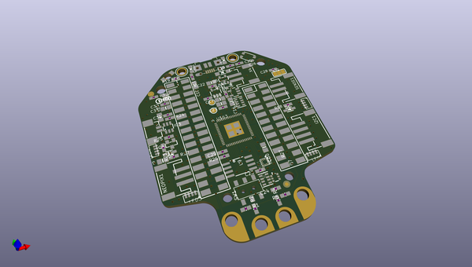
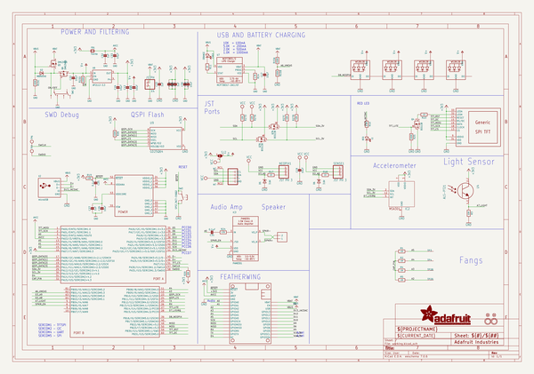
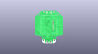
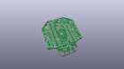
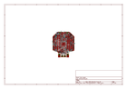
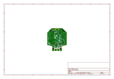
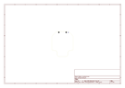
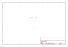
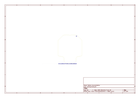
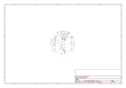

# OOMP Project  
## Adafruit-Hallowing-M4-PCB  by adafruit  
  
(snippet of original readme)  
  
-- Adafruit Hallowing M4 PCB  
  
<a href="http://www.adafruit.com/products/4300">   
Click here to purchase one from the Adafruit shop</a>  
  
PCB files for the Adafruit Hallowing M4.   
  
Format is EagleCAD schematic and board layout  
* https://www.adafruit.com/product/4300  
  
--- Description  
  
This is Hallowing..this is Hallowing... Hallowing! Hallowing!   
  
Following up on 2018's most-successful-skull-shaped development board, we UPPED our -skull-shaped development board game, and re-spinned (re-spun?) the HalloWing M0 into the HalloWing M4 with MORE of everything that makes this the spoooookiest dev board.  
  
Are you the kind of person who doesn't like taking down the skeletons and spiders until after January? Well, we've got the development board for you. This is electronics at its most spooky! The Adafruit HalloWing M4 is a skull-shaped ATSAM521 board with a ton of extras built in to make for an adorable wearable, badge, development kit, or the engine for your next cosplay or prop.  
  
On the front is a cute 1.54" sized 240x240 full color IPS TFT. Compared to the HalloWing M0's 1.44" 128x128, this has 4x as many pixels and is IPS for great color and brightness. Our default example code has our new fully-customizable spooky eye demo running but you can use it for anything you like to display in glorious color.  
  
There's also 4 fang-teeth below the display, these are analog/capacitive touch inputs with big alligator-clip holes.  
  
On the rever  
  full source readme at [readme_src.md](readme_src.md)  
  
source repo at: [https://github.com/adafruit/Adafruit-Hallowing-M4-PCB](https://github.com/adafruit/Adafruit-Hallowing-M4-PCB)  
## Board  
  
  
## Schematic  
  
  
  
[schematic pdf](working_schematic.pdf)  
## Images  
  
  
  
  
  
  
  
  
  
  
  
  
  
  
  
  
