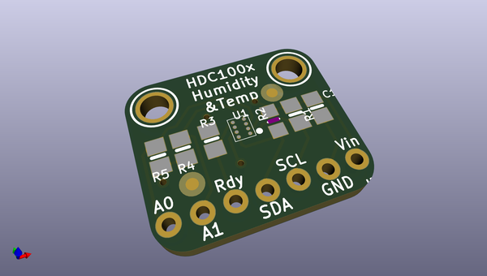
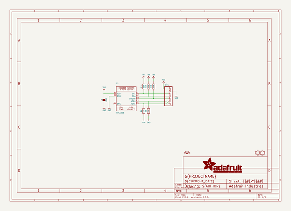
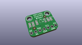
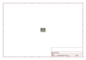
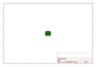
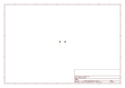
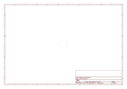

# OOMP Project  
## Adafruit-HDC1008-Breakout-PCB  by adafruit  
  
(snippet of original readme)  
  
-- Adafruit HDC1008 Breakout PCB  
  
<a href="http://www.adafruit.com/products/2635">   
Click here to purchase one from the Adafruit shop</a>  
  
PCB files for the Adafruit HDC1008 Breakout. Format is EagleCAD schematic and board layout  
* https://www.adafruit.com/products/2635  
  
--- DESCRIPTION  
It's summer and you're sweating and your hair's all frizzy and all you really want to know is why the weatherman said this morning that today's relative humidity would max out at a perfectly reasonable 52% when it feels more like 77%. Enter the HDC1008 Temperature + Humidity Sensor - the best way to prove the weatherman wrong!  
  
This I2C digital humidity sensor is a fairly accurate and intelligent alternative to the much simpler Humidity and Temperature Sensor - SHT15 Breakout It has a typical accuracy of ±4% with an operating range that's optimized from 10% to 80% RH. Operation outside this range is still possible - just the accuracy might drop a bit. The temperature output has a typical accuracy of ±0.2°C from -20~85°C.  
  
The HDC1008 sensor chip has 2 address-select pins, so you can have up to 4 shared on a single I2C bus. It's also 3-5V power and logic safe so you don't need any level shifters or regulators to use with a 5V or 3V microcontroller.  
  
Such a lovely chip, but only available in a tiny BGA package. So we spun up a breakout board with the chip and some extra passive components to make it easy to use. Each order comes with one ful  
  full source readme at [readme_src.md](readme_src.md)  
  
source repo at: [https://github.com/adafruit/Adafruit-HDC1008-Breakout-PCB](https://github.com/adafruit/Adafruit-HDC1008-Breakout-PCB)  
## Board  
  
  
## Schematic  
  
  
  
[schematic pdf](working_schematic.pdf)  
## Images  
  
  
  
  
  
  
  
  
  
  
  
  
  
  
  
  
