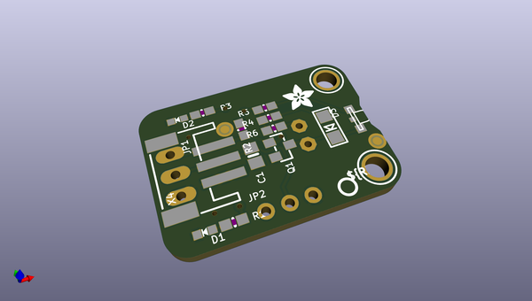
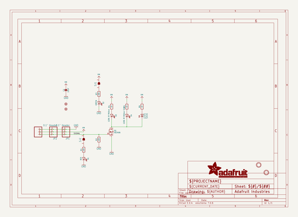
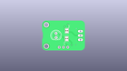
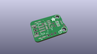
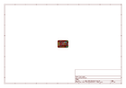
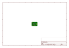
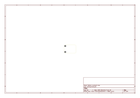
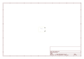
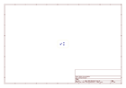
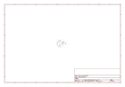

# OOMP Project  
## Adafruit-High-Power-Infrared-LED-Emitter-PCB  by adafruit  
  
(snippet of original readme)  
  
-- Adafruit High Power Infrared LED Emitter PCB  
  
<a href="http://www.adafruit.com/products/5639">   
Click here to purchase one from the Adafruit shop</a>  
  
PCB files for the Adafruit High Power Infrared LED Emitter.   
  
Format is EagleCAD schematic and board layout  
* https://www.adafruit.com/product/5639  
  
--- Description  
  
*pew* *pew*! This board is like a little ray gun for infrared light, with two high powered LED outputs. When controlled with the onboard N-Channel FET driver, you'll be blasting 100mA-200mA of current pulsing through each LED for 10+ meters of range! This is the easiest way to get great IR emitter range without wiring up a bunch of parts.  
  
By using a 2mm pitch STEMMA JST PH cable with headers or alligator clips on the end, you can easily wire this board up without any soldering at all.  
  
This board features a power transistor so you just need to provide about 3-5V DC power to the V+ power in, ground for ground, and then a 3-5V logic level signal on the input pin. When the pin is high, the LEDs are on, when the signal pin is low, the LEDs are off. Since humans don't see in IR, there's a red LED that will let you know when the IR LEDs are lit. Two LEDs are pre-soldered to the PCB, one pointing up and one pointing out. If you want even MORE coverage, there's a spot to solder in a separate 5mm IR LED (not included).  
  
If powering with 5V, the board will draw about 200mA per LED (400mA total) when pulsing on. If   
  full source readme at [readme_src.md](readme_src.md)  
  
source repo at: [https://github.com/adafruit/Adafruit-High-Power-Infrared-LED-Emitter-PCB](https://github.com/adafruit/Adafruit-High-Power-Infrared-LED-Emitter-PCB)  
## Board  
  
  
## Schematic  
  
  
  
[schematic pdf](working_schematic.pdf)  
## Images  
  
  
  
  
  
  
  
  
  
  
  
  
  
  
  
  
