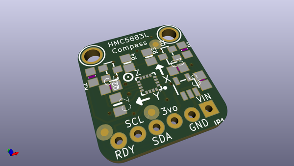
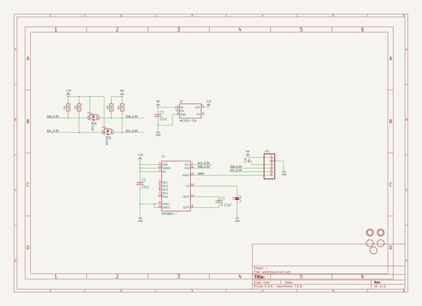
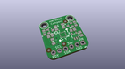
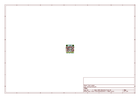
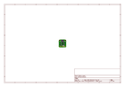
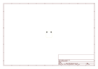
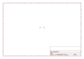
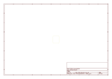
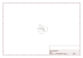

# OOMP Project  
## Adafruit-HMC5883-Mag-Compass-Sensor-PCB  by adafruit  
  
oomp key: oomp_projects_flat_adafruit_adafruit_hmc5883_mag_compass_sensor_pcb  
(snippet of original readme)  
  
- Adafruit HMC5883 Magnetic Compass Sensor PCB (Discontinued)  
<a href="http://www.adafruit.com/products/1746">   
Click here to review the Adafruit shop</a>  
  
We based this breakout on a popular and well loved magnetometer, the HMC5883L. This compact sensor uses I2C to communicate and its very easy to use. Since it's a 3.3V max chip, we added circuitry to make it 5V-safe logic and power, for easy use with either 3 or 5V microcontrollers. Simply connect VCC to +3-5V and ground to ground. Then read data from the I2C clock and data pins. There's also a Data Ready pin you can use to speed up reads.  
  
PCB files for Adafruit HMC5883 Mag Compass Sensor PCB. The format is EagleCAD schematic and board layout  
- https://www.adafruit.com/products/1746  
  
--- License  
  
Adafruit invests time and resources providing this open source design, please support Adafruit and open-source hardware by purchasing products from [Adafruit](https://www.adafruit.com)!  
  
All text above must be included in any redistribution  
  
Designed by Limor Fried/Ladyada for Adafruit Industries.  
Creative Commons Attribution/Share-Alike, all text above must be included in any redistribution.   
See license.txt for additional information.  
  
  full source readme at [readme_src.md](readme_src.md)  
  
source repo at: [https://github.com/adafruit/Adafruit-HMC5883-Mag-Compass-Sensor-PCB](https://github.com/adafruit/Adafruit-HMC5883-Mag-Compass-Sensor-PCB)  
## Board  
  
  
## Schematic  
  
  
  
[schematic pdf](working_schematic.pdf)  
## Images  
  
  
  
  
  
  
  
  
  
  
  
  
  
  
  
  
